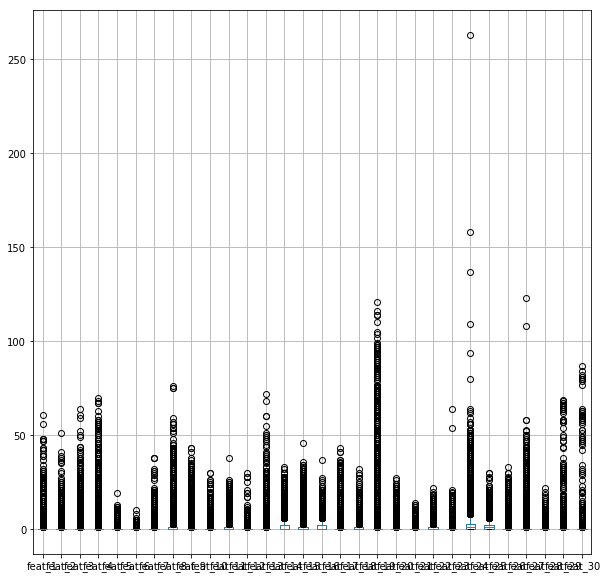
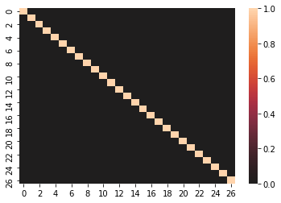

# Integrating PCA in Pipelines - Lab

## Introduction

In a previous section, you learned about how to use pipelines in scikit-learn to combine several supervised learning algorithms in a manageable pipeline. In this lesson, you will integrate PCA along with classifiers in the pipeline. 

## Objectives

In this lab you will: 

- Integrate PCA in scikit-learn pipelines 

## The Data Science Workflow

You will be following the data science workflow:

1. Initial data inspection, exploratory data analysis, and cleaning
2. Feature engineering and selection
3. Create a baseline model
4. Create a machine learning pipeline and compare results with the baseline model
5. Interpret the model and draw conclusions

##  Initial data inspection, exploratory data analysis, and cleaning

You'll use a dataset created by the Otto group, which was also used in a [Kaggle competition](https://www.kaggle.com/c/otto-group-product-classification-challenge/data). The description of the dataset is as follows:

The Otto Group is one of the world’s biggest e-commerce companies, with subsidiaries in more than 20 countries, including Crate & Barrel (USA), Otto.de (Germany) and 3 Suisses (France). They are selling millions of products worldwide every day, with several thousand products being added to their product line.

A consistent analysis of the performance of their products is crucial. However, due to their global infrastructure, many identical products get classified differently. Therefore, the quality of product analysis depends heavily on the ability to accurately cluster similar products. The better the classification, the more insights the Otto Group can generate about their product range.

In this lab, you'll use a dataset containing:
- A column `id`, which is an anonymous id unique to a product
- 93 columns `feat_1`, `feat_2`, ..., `feat_93`, which are the various features of a product
- a column `target` - the class of a product


The dataset is stored in the `'otto_group.csv'` file. Import this file into a DataFrame called `data`, and then: 

- Check for missing values 
- Check the distribution of columns 
- ... and any other things that come to your mind to explore the data 


```python
# Your code here
```


```python
# Your code here
```


```python
# Your code here
```


```python
# Your code here
```


```python
# Your code here
```


```python
# Your code here
```


```python
# __SOLUTION__ 
import pandas as pd
import numpy as np
import matplotlib.pyplot as plt
```


```python
# __SOLUTION__ 
data = pd.read_csv("otto_group.csv")
```


```python
# __SOLUTION__ 
data.head()
```


<div>
<style scoped>
    .dataframe tbody tr th:only-of-type {
        vertical-align: middle;
    }

    .dataframe tbody tr th {
        vertical-align: top;
    }

    .dataframe thead th {
        text-align: right;
    }
</style>
<table border="1" class="dataframe">
  <thead>
    <tr style="text-align: right;">
      <th></th>
      <th>id</th>
      <th>feat_1</th>
      <th>feat_2</th>
      <th>feat_3</th>
      <th>feat_4</th>
      <th>feat_5</th>
      <th>feat_6</th>
      <th>feat_7</th>
      <th>feat_8</th>
      <th>feat_9</th>
      <th>...</th>
      <th>feat_85</th>
      <th>feat_86</th>
      <th>feat_87</th>
      <th>feat_88</th>
      <th>feat_89</th>
      <th>feat_90</th>
      <th>feat_91</th>
      <th>feat_92</th>
      <th>feat_93</th>
      <th>target</th>
    </tr>
  </thead>
  <tbody>
    <tr>
      <th>0</th>
      <td>1</td>
      <td>1</td>
      <td>0</td>
      <td>0</td>
      <td>0</td>
      <td>0</td>
      <td>0</td>
      <td>0</td>
      <td>0</td>
      <td>0</td>
      <td>...</td>
      <td>1</td>
      <td>0</td>
      <td>0</td>
      <td>0</td>
      <td>0</td>
      <td>0</td>
      <td>0</td>
      <td>0</td>
      <td>0</td>
      <td>Class_1</td>
    </tr>
    <tr>
      <th>1</th>
      <td>2</td>
      <td>0</td>
      <td>0</td>
      <td>0</td>
      <td>0</td>
      <td>0</td>
      <td>0</td>
      <td>0</td>
      <td>1</td>
      <td>0</td>
      <td>...</td>
      <td>0</td>
      <td>0</td>
      <td>0</td>
      <td>0</td>
      <td>0</td>
      <td>0</td>
      <td>0</td>
      <td>0</td>
      <td>0</td>
      <td>Class_1</td>
    </tr>
    <tr>
      <th>2</th>
      <td>3</td>
      <td>0</td>
      <td>0</td>
      <td>0</td>
      <td>0</td>
      <td>0</td>
      <td>0</td>
      <td>0</td>
      <td>1</td>
      <td>0</td>
      <td>...</td>
      <td>0</td>
      <td>0</td>
      <td>0</td>
      <td>0</td>
      <td>0</td>
      <td>0</td>
      <td>0</td>
      <td>0</td>
      <td>0</td>
      <td>Class_1</td>
    </tr>
    <tr>
      <th>3</th>
      <td>4</td>
      <td>1</td>
      <td>0</td>
      <td>0</td>
      <td>1</td>
      <td>6</td>
      <td>1</td>
      <td>5</td>
      <td>0</td>
      <td>0</td>
      <td>...</td>
      <td>0</td>
      <td>1</td>
      <td>2</td>
      <td>0</td>
      <td>0</td>
      <td>0</td>
      <td>0</td>
      <td>0</td>
      <td>0</td>
      <td>Class_1</td>
    </tr>
    <tr>
      <th>4</th>
      <td>5</td>
      <td>0</td>
      <td>0</td>
      <td>0</td>
      <td>0</td>
      <td>0</td>
      <td>0</td>
      <td>0</td>
      <td>0</td>
      <td>0</td>
      <td>...</td>
      <td>1</td>
      <td>0</td>
      <td>0</td>
      <td>0</td>
      <td>0</td>
      <td>1</td>
      <td>0</td>
      <td>0</td>
      <td>0</td>
      <td>Class_1</td>
    </tr>
  </tbody>
</table>
<p>5 rows × 95 columns</p>
</div>


```python
# __SOLUTION__ 
data.info()
```

    <class 'pandas.core.frame.DataFrame'>
    RangeIndex: 61878 entries, 0 to 61877
    Data columns (total 95 columns):
    id         61878 non-null int64
    feat_1     61878 non-null int64
    feat_2     61878 non-null int64
    feat_3     61878 non-null int64
    feat_4     61878 non-null int64
    feat_5     61878 non-null int64
    feat_6     61878 non-null int64
    feat_7     61878 non-null int64
    feat_8     61878 non-null int64
    feat_9     61878 non-null int64
    feat_10    61878 non-null int64
    feat_11    61878 non-null int64
    feat_12    61878 non-null int64
    feat_13    61878 non-null int64
    feat_14    61878 non-null int64
    feat_15    61878 non-null int64
    feat_16    61878 non-null int64
    feat_17    61878 non-null int64
    feat_18    61878 non-null int64
    feat_19    61878 non-null int64
    feat_20    61878 non-null int64
    feat_21    61878 non-null int64
    feat_22    61878 non-null int64
    feat_23    61878 non-null int64
    feat_24    61878 non-null int64
    feat_25    61878 non-null int64
    feat_26    61878 non-null int64
    feat_27    61878 non-null int64
    feat_28    61878 non-null int64
    feat_29    61878 non-null int64
    feat_30    61878 non-null int64
    feat_31    61878 non-null int64
    feat_32    61878 non-null int64
    feat_33    61878 non-null int64
    feat_34    61878 non-null int64
    feat_35    61878 non-null int64
    feat_36    61878 non-null int64
    feat_37    61878 non-null int64
    feat_38    61878 non-null int64
    feat_39    61878 non-null int64
    feat_40    61878 non-null int64
    feat_41    61878 non-null int64
    feat_42    61878 non-null int64
    feat_43    61878 non-null int64
    feat_44    61878 non-null int64
    feat_45    61878 non-null int64
    feat_46    61878 non-null int64
    feat_47    61878 non-null int64
    feat_48    61878 non-null int64
    feat_49    61878 non-null int64
    feat_50    61878 non-null int64
    feat_51    61878 non-null int64
    feat_52    61878 non-null int64
    feat_53    61878 non-null int64
    feat_54    61878 non-null int64
    feat_55    61878 non-null int64
    feat_56    61878 non-null int64
    feat_57    61878 non-null int64
    feat_58    61878 non-null int64
    feat_59    61878 non-null int64
    feat_60    61878 non-null int64
    feat_61    61878 non-null int64
    feat_62    61878 non-null int64
    feat_63    61878 non-null int64
    feat_64    61878 non-null int64
    feat_65    61878 non-null int64
    feat_66    61878 non-null int64
    feat_67    61878 non-null int64
    feat_68    61878 non-null int64
    feat_69    61878 non-null int64
    feat_70    61878 non-null int64
    feat_71    61878 non-null int64
    feat_72    61878 non-null int64
    feat_73    61878 non-null int64
    feat_74    61878 non-null int64
    feat_75    61878 non-null int64
    feat_76    61878 non-null int64
    feat_77    61878 non-null int64
    feat_78    61878 non-null int64
    feat_79    61878 non-null int64
    feat_80    61878 non-null int64
    feat_81    61878 non-null int64
    feat_82    61878 non-null int64
    feat_83    61878 non-null int64
    feat_84    61878 non-null int64
    feat_85    61878 non-null int64
    feat_86    61878 non-null int64
    feat_87    61878 non-null int64
    feat_88    61878 non-null int64
    feat_89    61878 non-null int64
    feat_90    61878 non-null int64
    feat_91    61878 non-null int64
    feat_92    61878 non-null int64
    feat_93    61878 non-null int64
    target     61878 non-null object
    dtypes: int64(94), object(1)
    memory usage: 44.8+ MB


```python
# __SOLUTION__ 
data.isna().any()
```


    id         False
    feat_1     False
    feat_2     False
    feat_3     False
    feat_4     False
    feat_5     False
    feat_6     False
    feat_7     False
    feat_8     False
    feat_9     False
    feat_10    False
    feat_11    False
    feat_12    False
    feat_13    False
    feat_14    False
    feat_15    False
    feat_16    False
    feat_17    False
    feat_18    False
    feat_19    False
    feat_20    False
    feat_21    False
    feat_22    False
    feat_23    False
    feat_24    False
    feat_25    False
    feat_26    False
    feat_27    False
    feat_28    False
    feat_29    False
               ...  
    feat_65    False
    feat_66    False
    feat_67    False
    feat_68    False
    feat_69    False
    feat_70    False
    feat_71    False
    feat_72    False
    feat_73    False
    feat_74    False
    feat_75    False
    feat_76    False
    feat_77    False
    feat_78    False
    feat_79    False
    feat_80    False
    feat_81    False
    feat_82    False
    feat_83    False
    feat_84    False
    feat_85    False
    feat_86    False
    feat_87    False
    feat_88    False
    feat_89    False
    feat_90    False
    feat_91    False
    feat_92    False
    feat_93    False
    target     False
    Length: 95, dtype: bool


```python
# __SOLUTION__ 
# We only looked at some of the features here, make sure to do a quick check for all the features (similar structure)
feat = data.loc[:, 'feat_1':'feat_30']
feat.hist(figsize=(30,20));
```


If you look at all the histograms, you can tell that a lot of the data are zero-inflated, so most of the variables contain mostly zeros and then some higher values here and there. No normality, but for most machine learning techniques this is not an issue. 


```python
# Your code here
```


```python
# __SOLUTION__ 
feat.boxplot(figsize=(10,10));
```





Because there are so many zeroes, most values above zero will seem to be outliers. The safe decision for this data is to not delete any outliers and see what happens. With many 0s, sparse data is available and high values may be super informative. Moreover, without having any intuitive meaning for each of the features, we don't know if a value of ~260 is actually an outlier.


```python
# Your code here
```


```python
# __SOLUTION__ 
# Is there any missing data?

feat.isna().any().any()
```


    False


## Feature engineering and selection with PCA

Have a look at the correlation structure of your features using a [heatmap](https://seaborn.pydata.org/generated/seaborn.heatmap.html).


```python
# Your code here
```


```python
# __SOLUTION__ 
feat = data.loc[:, 'feat_1':'feat_93']

import seaborn as sns
sns.heatmap(feat.corr(), center=0);
```


Use PCA to select a number of features in a way that you still keep 80% of your explained variance.


```python
# Your code here
```


```python
# Your code here
```


```python
# __SOLUTION__ 
from sklearn.decomposition import PCA
pca_1 = PCA(n_components=20)
pca_2 = PCA(n_components=40)
pca_3 = PCA(n_components=60)

principalComponents = pca_1.fit_transform(feat)
principalComponents = pca_2.fit_transform(feat)
principalComponents = pca_3.fit_transform(feat)

print(np.sum(pca_1.explained_variance_ratio_))
print(np.sum(pca_2.explained_variance_ratio_))
print(np.sum(pca_3.explained_variance_ratio_))

pca = PCA(n_components=27)
principalComponents = pca.fit_transform(feat)
print(np.sum(pca.explained_variance_ratio_))
```

    0.7275643792253975
    0.8885505230944062
    0.9598045557819248
    0.8003287639023293


```python
# __SOLUTION__ 
import seaborn as sns
sns.heatmap(pd.DataFrame(principalComponents).corr(), center=0);
```





## Create a train-test split with a test size of 40%

This is a relatively big training set, so you can assign 40% to the test set. Set the `random_state` to 42. 


```python
# Your code here
```


```python
# Your code here
```


```python
# __SOLUTION__ 
y = data['target']
X = data.loc[:, 'feat_1':'feat_93']
```


```python
# __SOLUTION__ 
# Load and split the data

from sklearn.model_selection import train_test_split
X_train, X_test, y_train, y_test = train_test_split(X, y, test_size=0.4, random_state=42)
```

## Create a baseline model

Create your baseline model *in a pipeline setting*. In the pipeline: 

- Your first step will be to scale your features down to the number of features that ensure you keep just 80% of your explained variance (which we saw before)
- Your second step will be to build a basic logistic regression model 

Make sure to fit the model using the training set and test the result by obtaining the accuracy using the test set. Set the `random_state` to 123. 


```python
# Your code here
```


```python
# Your code here
```


```python
# Your code here
```


```python
# __SOLUTION__ 
from sklearn.linear_model import LogisticRegression
from sklearn.pipeline import Pipeline
```


```python
# __SOLUTION__ 
# Construct some pipelines
pipe_lr = Pipeline([('pca', PCA(n_components=27, random_state=123)), 
                    ('clf', LogisticRegression(random_state=123))])

# Fit the pipelines
pipe_lr.fit(X_train, y_train)

print(pipe_lr.score(X_test, y_test))
```

    0.7171541693600517


```python
# __SOLUTION__ 
np.sum(pipe_lr.predict(X_test) == y_test)/len(y_test)
```


    0.7171541693600517


## Create a pipeline consisting of a linear SVM, a simple decision tree, and a simple random forest classifier

Repeat the above, but now create three different pipelines:
- One for a standard linear SVM
- One for a default decision tree
- One for a random forest classifier


```python
# Your code here
# ⏰ This cell may take several minutes to run
```


```python
# __SOLUTION__ 
# ⏰ This cell may take several minutes to run
from sklearn import svm
from sklearn.pipeline import Pipeline
from sklearn.ensemble import RandomForestClassifier
from sklearn import tree

## KEEP IT FOR NOW
# Construct some pipelines
pipe_svm = Pipeline([('pca', PCA(n_components=27)), 
                     ('clf', svm.SVC(random_state=123))])
        
pipe_tree = Pipeline([('pca', PCA(n_components=27)), 
                      ('clf', tree.DecisionTreeClassifier(random_state=123))])

pipe_rf = Pipeline([('pca', PCA(n_components=27)), 
                    ('clf', RandomForestClassifier(random_state=123))])

# List of pipelines and pipeline names
pipelines = [pipe_svm, pipe_tree, pipe_rf]
pipeline_names = ['Support Vector Machine','Decision Tree','Random Forest']

# Loop to fit each of the three pipelines
for pipe in pipelines:
    print(pipe)
    pipe.fit(X_train, y_train)

# Compare accuracies
for index, val in enumerate(pipelines):
    print('%s pipeline test accuracy: %.3f' % (pipeline_names[index], val.score(X_test, y_test)))
```

    Pipeline(memory=None,
         steps=[('pca', PCA(copy=True, iterated_power='auto', n_components=27, random_state=None,
      svd_solver='auto', tol=0.0, whiten=False)), ('clf', SVC(C=1.0, cache_size=200, class_weight=None, coef0=0.0,
      decision_function_shape='ovr', degree=3, gamma='auto', kernel='rbf',
      max_iter=-1, probability=False, random_state=123, shrinking=True,
      tol=0.001, verbose=False))])
    Pipeline(memory=None,
         steps=[('pca', PCA(copy=True, iterated_power='auto', n_components=27, random_state=None,
      svd_solver='auto', tol=0.0, whiten=False)), ('clf', DecisionTreeClassifier(class_weight=None, criterion='gini', max_depth=None,
                max_features=None, max_leaf_nodes=None,
                min_impurity_decrease=0.0, min_impurity_split=None,
                min_samples_leaf=1, min_samples_split=2,
                min_weight_fraction_leaf=0.0, presort=False, random_state=123,
                splitter='best'))])
    Pipeline(memory=None,
         steps=[('pca', PCA(copy=True, iterated_power='auto', n_components=27, random_state=None,
      svd_solver='auto', tol=0.0, whiten=False)), ('clf', RandomForestClassifier(bootstrap=True, class_weight=None, criterion='gini',
                max_depth=None, max_features='auto', max_leaf_nodes=None,
               ...timators=10, n_jobs=1,
                oob_score=False, random_state=123, verbose=0, warm_start=False))])
    Support Vector Machine pipeline test accuracy: 0.749
    Decision Tree pipeline test accuracy: 0.666
    Random Forest pipeline test accuracy: 0.745


## Pipeline with grid search

Construct two pipelines with grid search:
- one for random forests - try to have around 40 different models
- one for the AdaBoost algorithm 

### Random Forest pipeline with grid search


```python
# Your code here 
# imports
```


```python
# Your code here
# ⏰ This cell may take a long time to run!

```


```python
# __SOLUTION__ 
# imports
from sklearn import svm
from sklearn.model_selection import GridSearchCV
from sklearn.pipeline import Pipeline
```


```python
# __SOLUTION__ 
# ⏰ This cell may take a long time to run!
# Construct pipeline
pipe_rf = Pipeline([('pca', PCA(n_components=27)), 
                    ('clf', RandomForestClassifier(random_state = 123))])

# Set grid search params
param_grid_forest = [ 
  {'clf__n_estimators': [120],
   'clf__criterion': ['entropy', 'gini'], 
   'clf__max_depth': [4, 5, 6],  
   'clf__min_samples_leaf':[0.05 ,0.1, 0.2],  
   'clf__min_samples_split':[0.05 ,0.1, 0.2]
  }
]

# Construct grid search
gs_rf = GridSearchCV(estimator=pipe_rf, 
                     param_grid=param_grid_forest, 
                     scoring='accuracy', 
                     cv=3, verbose=2, return_train_score = True)

# Fit using grid search
gs_rf.fit(X_train, y_train)

# Best accuracy
print('Best accuracy: %.3f' % gs_rf.best_score_)

# Best params
print('\nBest params:\n', gs_rf.best_params_)
```

    Fitting 3 folds for each of 54 candidates, totalling 162 fits
    [CV] clf__criterion=entropy, clf__max_depth=4, clf__min_samples_leaf=0.05, clf__min_samples_split=0.05, clf__n_estimators=120 
    [CV]  clf__criterion=entropy, clf__max_depth=4, clf__min_samples_leaf=0.05, clf__min_samples_split=0.05, clf__n_estimators=120, total=   7.2s
    [CV] clf__criterion=entropy, clf__max_depth=4, clf__min_samples_leaf=0.05, clf__min_samples_split=0.05, clf__n_estimators=120 


    [Parallel(n_jobs=1)]: Done   1 out of   1 | elapsed:    7.4s remaining:    0.0s


    [CV]  clf__criterion=entropy, clf__max_depth=4, clf__min_samples_leaf=0.05, clf__min_samples_split=0.05, clf__n_estimators=120, total=   7.2s
    [CV] clf__criterion=entropy, clf__max_depth=4, clf__min_samples_leaf=0.05, clf__min_samples_split=0.05, clf__n_estimators=120 
    [CV]  clf__criterion=entropy, clf__max_depth=4, clf__min_samples_leaf=0.05, clf__min_samples_split=0.05, clf__n_estimators=120, total=   7.3s
    [CV] clf__criterion=entropy, clf__max_depth=4, clf__min_samples_leaf=0.05, clf__min_samples_split=0.1, clf__n_estimators=120 
    [CV]  clf__criterion=entropy, clf__max_depth=4, clf__min_samples_leaf=0.05, clf__min_samples_split=0.1, clf__n_estimators=120, total=   7.1s
    [CV] clf__criterion=entropy, clf__max_depth=4, clf__min_samples_leaf=0.05, clf__min_samples_split=0.1, clf__n_estimators=120 
    [CV]  clf__criterion=entropy, clf__max_depth=4, clf__min_samples_leaf=0.05, clf__min_samples_split=0.1, clf__n_estimators=120, total=   7.2s
    [CV] clf__criterion=entropy, clf__max_depth=4, clf__min_samples_leaf=0.05, clf__min_samples_split=0.1, clf__n_estimators=120 
    [CV]  clf__criterion=entropy, clf__max_depth=4, clf__min_samples_leaf=0.05, clf__min_samples_split=0.1, clf__n_estimators=120, total=   7.2s
    [CV] clf__criterion=entropy, clf__max_depth=4, clf__min_samples_leaf=0.05, clf__min_samples_split=0.2, clf__n_estimators=120 
    [CV]  clf__criterion=entropy, clf__max_depth=4, clf__min_samples_leaf=0.05, clf__min_samples_split=0.2, clf__n_estimators=120, total=   6.3s
    [CV] clf__criterion=entropy, clf__max_depth=4, clf__min_samples_leaf=0.05, clf__min_samples_split=0.2, clf__n_estimators=120 
    [CV]  clf__criterion=entropy, clf__max_depth=4, clf__min_samples_leaf=0.05, clf__min_samples_split=0.2, clf__n_estimators=120, total=   6.4s
    [CV] clf__criterion=entropy, clf__max_depth=4, clf__min_samples_leaf=0.05, clf__min_samples_split=0.2, clf__n_estimators=120 
    [CV]  clf__criterion=entropy, clf__max_depth=4, clf__min_samples_leaf=0.05, clf__min_samples_split=0.2, clf__n_estimators=120, total=   6.4s
    [CV] clf__criterion=entropy, clf__max_depth=4, clf__min_samples_leaf=0.1, clf__min_samples_split=0.05, clf__n_estimators=120 
    [CV]  clf__criterion=entropy, clf__max_depth=4, clf__min_samples_leaf=0.1, clf__min_samples_split=0.05, clf__n_estimators=120, total=   4.8s
    [CV] clf__criterion=entropy, clf__max_depth=4, clf__min_samples_leaf=0.1, clf__min_samples_split=0.05, clf__n_estimators=120 
    [CV]  clf__criterion=entropy, clf__max_depth=4, clf__min_samples_leaf=0.1, clf__min_samples_split=0.05, clf__n_estimators=120, total=   4.8s
    [CV] clf__criterion=entropy, clf__max_depth=4, clf__min_samples_leaf=0.1, clf__min_samples_split=0.05, clf__n_estimators=120 
    [CV]  clf__criterion=entropy, clf__max_depth=4, clf__min_samples_leaf=0.1, clf__min_samples_split=0.05, clf__n_estimators=120, total=   4.8s
    [CV] clf__criterion=entropy, clf__max_depth=4, clf__min_samples_leaf=0.1, clf__min_samples_split=0.1, clf__n_estimators=120 
    [CV]  clf__criterion=entropy, clf__max_depth=4, clf__min_samples_leaf=0.1, clf__min_samples_split=0.1, clf__n_estimators=120, total=   4.7s
    [CV] clf__criterion=entropy, clf__max_depth=4, clf__min_samples_leaf=0.1, clf__min_samples_split=0.1, clf__n_estimators=120 
    [CV]  clf__criterion=entropy, clf__max_depth=4, clf__min_samples_leaf=0.1, clf__min_samples_split=0.1, clf__n_estimators=120, total=   4.7s
    [CV] clf__criterion=entropy, clf__max_depth=4, clf__min_samples_leaf=0.1, clf__min_samples_split=0.1, clf__n_estimators=120 
    [CV]  clf__criterion=entropy, clf__max_depth=4, clf__min_samples_leaf=0.1, clf__min_samples_split=0.1, clf__n_estimators=120, total=   4.8s
    [CV] clf__criterion=entropy, clf__max_depth=4, clf__min_samples_leaf=0.1, clf__min_samples_split=0.2, clf__n_estimators=120 
    [CV]  clf__criterion=entropy, clf__max_depth=4, clf__min_samples_leaf=0.1, clf__min_samples_split=0.2, clf__n_estimators=120, total=   4.7s
    [CV] clf__criterion=entropy, clf__max_depth=4, clf__min_samples_leaf=0.1, clf__min_samples_split=0.2, clf__n_estimators=120 
    [CV]  clf__criterion=entropy, clf__max_depth=4, clf__min_samples_leaf=0.1, clf__min_samples_split=0.2, clf__n_estimators=120, total=   4.7s
    [CV] clf__criterion=entropy, clf__max_depth=4, clf__min_samples_leaf=0.1, clf__min_samples_split=0.2, clf__n_estimators=120 
    [CV]  clf__criterion=entropy, clf__max_depth=4, clf__min_samples_leaf=0.1, clf__min_samples_split=0.2, clf__n_estimators=120, total=   4.8s
    [CV] clf__criterion=entropy, clf__max_depth=4, clf__min_samples_leaf=0.2, clf__min_samples_split=0.05, clf__n_estimators=120 
    [CV]  clf__criterion=entropy, clf__max_depth=4, clf__min_samples_leaf=0.2, clf__min_samples_split=0.05, clf__n_estimators=120, total=   2.4s
    [CV] clf__criterion=entropy, clf__max_depth=4, clf__min_samples_leaf=0.2, clf__min_samples_split=0.05, clf__n_estimators=120 
    [CV]  clf__criterion=entropy, clf__max_depth=4, clf__min_samples_leaf=0.2, clf__min_samples_split=0.05, clf__n_estimators=120, total=   2.4s
    [CV] clf__criterion=entropy, clf__max_depth=4, clf__min_samples_leaf=0.2, clf__min_samples_split=0.05, clf__n_estimators=120 
    [CV]  clf__criterion=entropy, clf__max_depth=4, clf__min_samples_leaf=0.2, clf__min_samples_split=0.05, clf__n_estimators=120, total=   2.5s
    [CV] clf__criterion=entropy, clf__max_depth=4, clf__min_samples_leaf=0.2, clf__min_samples_split=0.1, clf__n_estimators=120 
    [CV]  clf__criterion=entropy, clf__max_depth=4, clf__min_samples_leaf=0.2, clf__min_samples_split=0.1, clf__n_estimators=120, total=   2.4s
    [CV] clf__criterion=entropy, clf__max_depth=4, clf__min_samples_leaf=0.2, clf__min_samples_split=0.1, clf__n_estimators=120 
    [CV]  clf__criterion=entropy, clf__max_depth=4, clf__min_samples_leaf=0.2, clf__min_samples_split=0.1, clf__n_estimators=120, total=   2.4s
    [CV] clf__criterion=entropy, clf__max_depth=4, clf__min_samples_leaf=0.2, clf__min_samples_split=0.1, clf__n_estimators=120 
    [CV]  clf__criterion=entropy, clf__max_depth=4, clf__min_samples_leaf=0.2, clf__min_samples_split=0.1, clf__n_estimators=120, total=   2.4s
    [CV] clf__criterion=entropy, clf__max_depth=4, clf__min_samples_leaf=0.2, clf__min_samples_split=0.2, clf__n_estimators=120 
    [CV]  clf__criterion=entropy, clf__max_depth=4, clf__min_samples_leaf=0.2, clf__min_samples_split=0.2, clf__n_estimators=120, total=   2.5s
    [CV] clf__criterion=entropy, clf__max_depth=4, clf__min_samples_leaf=0.2, clf__min_samples_split=0.2, clf__n_estimators=120 
    [CV]  clf__criterion=entropy, clf__max_depth=4, clf__min_samples_leaf=0.2, clf__min_samples_split=0.2, clf__n_estimators=120, total=   2.4s
    [CV] clf__criterion=entropy, clf__max_depth=4, clf__min_samples_leaf=0.2, clf__min_samples_split=0.2, clf__n_estimators=120 
    [CV]  clf__criterion=entropy, clf__max_depth=4, clf__min_samples_leaf=0.2, clf__min_samples_split=0.2, clf__n_estimators=120, total=   2.4s
    [CV] clf__criterion=entropy, clf__max_depth=5, clf__min_samples_leaf=0.05, clf__min_samples_split=0.05, clf__n_estimators=120 
    [CV]  clf__criterion=entropy, clf__max_depth=5, clf__min_samples_leaf=0.05, clf__min_samples_split=0.05, clf__n_estimators=120, total=   7.5s
    [CV] clf__criterion=entropy, clf__max_depth=5, clf__min_samples_leaf=0.05, clf__min_samples_split=0.05, clf__n_estimators=120 
    [CV]  clf__criterion=entropy, clf__max_depth=5, clf__min_samples_leaf=0.05, clf__min_samples_split=0.05, clf__n_estimators=120, total=   7.6s
    [CV] clf__criterion=entropy, clf__max_depth=5, clf__min_samples_leaf=0.05, clf__min_samples_split=0.05, clf__n_estimators=120 
    [CV]  clf__criterion=entropy, clf__max_depth=5, clf__min_samples_leaf=0.05, clf__min_samples_split=0.05, clf__n_estimators=120, total=   7.7s
    [CV] clf__criterion=entropy, clf__max_depth=5, clf__min_samples_leaf=0.05, clf__min_samples_split=0.1, clf__n_estimators=120 
    [CV]  clf__criterion=entropy, clf__max_depth=5, clf__min_samples_leaf=0.05, clf__min_samples_split=0.1, clf__n_estimators=120, total=   7.4s
    [CV] clf__criterion=entropy, clf__max_depth=5, clf__min_samples_leaf=0.05, clf__min_samples_split=0.1, clf__n_estimators=120 
    [CV]  clf__criterion=entropy, clf__max_depth=5, clf__min_samples_leaf=0.05, clf__min_samples_split=0.1, clf__n_estimators=120, total=   7.5s
    [CV] clf__criterion=entropy, clf__max_depth=5, clf__min_samples_leaf=0.05, clf__min_samples_split=0.1, clf__n_estimators=120 
    [CV]  clf__criterion=entropy, clf__max_depth=5, clf__min_samples_leaf=0.05, clf__min_samples_split=0.1, clf__n_estimators=120, total=   7.6s
    [CV] clf__criterion=entropy, clf__max_depth=5, clf__min_samples_leaf=0.05, clf__min_samples_split=0.2, clf__n_estimators=120 
    [CV]  clf__criterion=entropy, clf__max_depth=5, clf__min_samples_leaf=0.05, clf__min_samples_split=0.2, clf__n_estimators=120, total=   6.3s
    [CV] clf__criterion=entropy, clf__max_depth=5, clf__min_samples_leaf=0.05, clf__min_samples_split=0.2, clf__n_estimators=120 
    [CV]  clf__criterion=entropy, clf__max_depth=5, clf__min_samples_leaf=0.05, clf__min_samples_split=0.2, clf__n_estimators=120, total=   6.5s
    [CV] clf__criterion=entropy, clf__max_depth=5, clf__min_samples_leaf=0.05, clf__min_samples_split=0.2, clf__n_estimators=120 
    [CV]  clf__criterion=entropy, clf__max_depth=5, clf__min_samples_leaf=0.05, clf__min_samples_split=0.2, clf__n_estimators=120, total=   6.4s
    [CV] clf__criterion=entropy, clf__max_depth=5, clf__min_samples_leaf=0.1, clf__min_samples_split=0.05, clf__n_estimators=120 
    [CV]  clf__criterion=entropy, clf__max_depth=5, clf__min_samples_leaf=0.1, clf__min_samples_split=0.05, clf__n_estimators=120, total=   4.7s
    [CV] clf__criterion=entropy, clf__max_depth=5, clf__min_samples_leaf=0.1, clf__min_samples_split=0.05, clf__n_estimators=120 
    [CV]  clf__criterion=entropy, clf__max_depth=5, clf__min_samples_leaf=0.1, clf__min_samples_split=0.05, clf__n_estimators=120, total=   4.7s
    [CV] clf__criterion=entropy, clf__max_depth=5, clf__min_samples_leaf=0.1, clf__min_samples_split=0.05, clf__n_estimators=120 
    [CV]  clf__criterion=entropy, clf__max_depth=5, clf__min_samples_leaf=0.1, clf__min_samples_split=0.05, clf__n_estimators=120, total=   4.8s
    [CV] clf__criterion=entropy, clf__max_depth=5, clf__min_samples_leaf=0.1, clf__min_samples_split=0.1, clf__n_estimators=120 
    [CV]  clf__criterion=entropy, clf__max_depth=5, clf__min_samples_leaf=0.1, clf__min_samples_split=0.1, clf__n_estimators=120, total=   4.8s
    [CV] clf__criterion=entropy, clf__max_depth=5, clf__min_samples_leaf=0.1, clf__min_samples_split=0.1, clf__n_estimators=120 
    [CV]  clf__criterion=entropy, clf__max_depth=5, clf__min_samples_leaf=0.1, clf__min_samples_split=0.1, clf__n_estimators=120, total=   4.7s
    [CV] clf__criterion=entropy, clf__max_depth=5, clf__min_samples_leaf=0.1, clf__min_samples_split=0.1, clf__n_estimators=120 
    [CV]  clf__criterion=entropy, clf__max_depth=5, clf__min_samples_leaf=0.1, clf__min_samples_split=0.1, clf__n_estimators=120, total=   4.8s
    [CV] clf__criterion=entropy, clf__max_depth=5, clf__min_samples_leaf=0.1, clf__min_samples_split=0.2, clf__n_estimators=120 
    [CV]  clf__criterion=entropy, clf__max_depth=5, clf__min_samples_leaf=0.1, clf__min_samples_split=0.2, clf__n_estimators=120, total=   4.7s
    [CV] clf__criterion=entropy, clf__max_depth=5, clf__min_samples_leaf=0.1, clf__min_samples_split=0.2, clf__n_estimators=120 
    [CV]  clf__criterion=entropy, clf__max_depth=5, clf__min_samples_leaf=0.1, clf__min_samples_split=0.2, clf__n_estimators=120, total=   4.7s
    [CV] clf__criterion=entropy, clf__max_depth=5, clf__min_samples_leaf=0.1, clf__min_samples_split=0.2, clf__n_estimators=120 
    [CV]  clf__criterion=entropy, clf__max_depth=5, clf__min_samples_leaf=0.1, clf__min_samples_split=0.2, clf__n_estimators=120, total=   4.8s
    [CV] clf__criterion=entropy, clf__max_depth=5, clf__min_samples_leaf=0.2, clf__min_samples_split=0.05, clf__n_estimators=120 
    [CV]  clf__criterion=entropy, clf__max_depth=5, clf__min_samples_leaf=0.2, clf__min_samples_split=0.05, clf__n_estimators=120, total=   2.4s
    [CV] clf__criterion=entropy, clf__max_depth=5, clf__min_samples_leaf=0.2, clf__min_samples_split=0.05, clf__n_estimators=120 
    [CV]  clf__criterion=entropy, clf__max_depth=5, clf__min_samples_leaf=0.2, clf__min_samples_split=0.05, clf__n_estimators=120, total=   2.4s
    [CV] clf__criterion=entropy, clf__max_depth=5, clf__min_samples_leaf=0.2, clf__min_samples_split=0.05, clf__n_estimators=120 
    [CV]  clf__criterion=entropy, clf__max_depth=5, clf__min_samples_leaf=0.2, clf__min_samples_split=0.05, clf__n_estimators=120, total=   2.4s
    [CV] clf__criterion=entropy, clf__max_depth=5, clf__min_samples_leaf=0.2, clf__min_samples_split=0.1, clf__n_estimators=120 
    [CV]  clf__criterion=entropy, clf__max_depth=5, clf__min_samples_leaf=0.2, clf__min_samples_split=0.1, clf__n_estimators=120, total=   2.4s
    [CV] clf__criterion=entropy, clf__max_depth=5, clf__min_samples_leaf=0.2, clf__min_samples_split=0.1, clf__n_estimators=120 
    [CV]  clf__criterion=entropy, clf__max_depth=5, clf__min_samples_leaf=0.2, clf__min_samples_split=0.1, clf__n_estimators=120, total=   2.5s
    [CV] clf__criterion=entropy, clf__max_depth=5, clf__min_samples_leaf=0.2, clf__min_samples_split=0.1, clf__n_estimators=120 
    [CV]  clf__criterion=entropy, clf__max_depth=5, clf__min_samples_leaf=0.2, clf__min_samples_split=0.1, clf__n_estimators=120, total=   2.6s
    [CV] clf__criterion=entropy, clf__max_depth=5, clf__min_samples_leaf=0.2, clf__min_samples_split=0.2, clf__n_estimators=120 
    [CV]  clf__criterion=entropy, clf__max_depth=5, clf__min_samples_leaf=0.2, clf__min_samples_split=0.2, clf__n_estimators=120, total=   2.8s
    [CV] clf__criterion=entropy, clf__max_depth=5, clf__min_samples_leaf=0.2, clf__min_samples_split=0.2, clf__n_estimators=120 
    [CV]  clf__criterion=entropy, clf__max_depth=5, clf__min_samples_leaf=0.2, clf__min_samples_split=0.2, clf__n_estimators=120, total=   2.5s
    [CV] clf__criterion=entropy, clf__max_depth=5, clf__min_samples_leaf=0.2, clf__min_samples_split=0.2, clf__n_estimators=120 
    [CV]  clf__criterion=entropy, clf__max_depth=5, clf__min_samples_leaf=0.2, clf__min_samples_split=0.2, clf__n_estimators=120, total=   2.8s
    [CV] clf__criterion=entropy, clf__max_depth=6, clf__min_samples_leaf=0.05, clf__min_samples_split=0.05, clf__n_estimators=120 
    [CV]  clf__criterion=entropy, clf__max_depth=6, clf__min_samples_leaf=0.05, clf__min_samples_split=0.05, clf__n_estimators=120, total=   8.4s
    [CV] clf__criterion=entropy, clf__max_depth=6, clf__min_samples_leaf=0.05, clf__min_samples_split=0.05, clf__n_estimators=120 
    [CV]  clf__criterion=entropy, clf__max_depth=6, clf__min_samples_leaf=0.05, clf__min_samples_split=0.05, clf__n_estimators=120, total=   8.0s
    [CV] clf__criterion=entropy, clf__max_depth=6, clf__min_samples_leaf=0.05, clf__min_samples_split=0.05, clf__n_estimators=120 
    [CV]  clf__criterion=entropy, clf__max_depth=6, clf__min_samples_leaf=0.05, clf__min_samples_split=0.05, clf__n_estimators=120, total=   7.8s
    [CV] clf__criterion=entropy, clf__max_depth=6, clf__min_samples_leaf=0.05, clf__min_samples_split=0.1, clf__n_estimators=120 
    [CV]  clf__criterion=entropy, clf__max_depth=6, clf__min_samples_leaf=0.05, clf__min_samples_split=0.1, clf__n_estimators=120, total=   7.5s
    [CV] clf__criterion=entropy, clf__max_depth=6, clf__min_samples_leaf=0.05, clf__min_samples_split=0.1, clf__n_estimators=120 
    [CV]  clf__criterion=entropy, clf__max_depth=6, clf__min_samples_leaf=0.05, clf__min_samples_split=0.1, clf__n_estimators=120, total=   7.7s
    [CV] clf__criterion=entropy, clf__max_depth=6, clf__min_samples_leaf=0.05, clf__min_samples_split=0.1, clf__n_estimators=120 
    [CV]  clf__criterion=entropy, clf__max_depth=6, clf__min_samples_leaf=0.05, clf__min_samples_split=0.1, clf__n_estimators=120, total=   7.8s
    [CV] clf__criterion=entropy, clf__max_depth=6, clf__min_samples_leaf=0.05, clf__min_samples_split=0.2, clf__n_estimators=120 
    [CV]  clf__criterion=entropy, clf__max_depth=6, clf__min_samples_leaf=0.05, clf__min_samples_split=0.2, clf__n_estimators=120, total=   6.4s
    [CV] clf__criterion=entropy, clf__max_depth=6, clf__min_samples_leaf=0.05, clf__min_samples_split=0.2, clf__n_estimators=120 
    [CV]  clf__criterion=entropy, clf__max_depth=6, clf__min_samples_leaf=0.05, clf__min_samples_split=0.2, clf__n_estimators=120, total=   6.5s
    [CV] clf__criterion=entropy, clf__max_depth=6, clf__min_samples_leaf=0.05, clf__min_samples_split=0.2, clf__n_estimators=120 
    [CV]  clf__criterion=entropy, clf__max_depth=6, clf__min_samples_leaf=0.05, clf__min_samples_split=0.2, clf__n_estimators=120, total=   6.5s
    [CV] clf__criterion=entropy, clf__max_depth=6, clf__min_samples_leaf=0.1, clf__min_samples_split=0.05, clf__n_estimators=120 
    [CV]  clf__criterion=entropy, clf__max_depth=6, clf__min_samples_leaf=0.1, clf__min_samples_split=0.05, clf__n_estimators=120, total=   4.7s
    [CV] clf__criterion=entropy, clf__max_depth=6, clf__min_samples_leaf=0.1, clf__min_samples_split=0.05, clf__n_estimators=120 
    [CV]  clf__criterion=entropy, clf__max_depth=6, clf__min_samples_leaf=0.1, clf__min_samples_split=0.05, clf__n_estimators=120, total=   4.8s
    [CV] clf__criterion=entropy, clf__max_depth=6, clf__min_samples_leaf=0.1, clf__min_samples_split=0.05, clf__n_estimators=120 
    [CV]  clf__criterion=entropy, clf__max_depth=6, clf__min_samples_leaf=0.1, clf__min_samples_split=0.05, clf__n_estimators=120, total=   4.8s
    [CV] clf__criterion=entropy, clf__max_depth=6, clf__min_samples_leaf=0.1, clf__min_samples_split=0.1, clf__n_estimators=120 
    [CV]  clf__criterion=entropy, clf__max_depth=6, clf__min_samples_leaf=0.1, clf__min_samples_split=0.1, clf__n_estimators=120, total=   4.7s
    [CV] clf__criterion=entropy, clf__max_depth=6, clf__min_samples_leaf=0.1, clf__min_samples_split=0.1, clf__n_estimators=120 
    [CV]  clf__criterion=entropy, clf__max_depth=6, clf__min_samples_leaf=0.1, clf__min_samples_split=0.1, clf__n_estimators=120, total=   4.7s
    [CV] clf__criterion=entropy, clf__max_depth=6, clf__min_samples_leaf=0.1, clf__min_samples_split=0.1, clf__n_estimators=120 
    [CV]  clf__criterion=entropy, clf__max_depth=6, clf__min_samples_leaf=0.1, clf__min_samples_split=0.1, clf__n_estimators=120, total=   4.8s
    [CV] clf__criterion=entropy, clf__max_depth=6, clf__min_samples_leaf=0.1, clf__min_samples_split=0.2, clf__n_estimators=120 
    [CV]  clf__criterion=entropy, clf__max_depth=6, clf__min_samples_leaf=0.1, clf__min_samples_split=0.2, clf__n_estimators=120, total=   4.7s
    [CV] clf__criterion=entropy, clf__max_depth=6, clf__min_samples_leaf=0.1, clf__min_samples_split=0.2, clf__n_estimators=120 
    [CV]  clf__criterion=entropy, clf__max_depth=6, clf__min_samples_leaf=0.1, clf__min_samples_split=0.2, clf__n_estimators=120, total=   4.8s
    [CV] clf__criterion=entropy, clf__max_depth=6, clf__min_samples_leaf=0.1, clf__min_samples_split=0.2, clf__n_estimators=120 
    [CV]  clf__criterion=entropy, clf__max_depth=6, clf__min_samples_leaf=0.1, clf__min_samples_split=0.2, clf__n_estimators=120, total=   4.8s
    [CV] clf__criterion=entropy, clf__max_depth=6, clf__min_samples_leaf=0.2, clf__min_samples_split=0.05, clf__n_estimators=120 
    [CV]  clf__criterion=entropy, clf__max_depth=6, clf__min_samples_leaf=0.2, clf__min_samples_split=0.05, clf__n_estimators=120, total=   2.4s
    [CV] clf__criterion=entropy, clf__max_depth=6, clf__min_samples_leaf=0.2, clf__min_samples_split=0.05, clf__n_estimators=120 
    [CV]  clf__criterion=entropy, clf__max_depth=6, clf__min_samples_leaf=0.2, clf__min_samples_split=0.05, clf__n_estimators=120, total=   2.4s
    [CV] clf__criterion=entropy, clf__max_depth=6, clf__min_samples_leaf=0.2, clf__min_samples_split=0.05, clf__n_estimators=120 
    [CV]  clf__criterion=entropy, clf__max_depth=6, clf__min_samples_leaf=0.2, clf__min_samples_split=0.05, clf__n_estimators=120, total=   2.4s
    [CV] clf__criterion=entropy, clf__max_depth=6, clf__min_samples_leaf=0.2, clf__min_samples_split=0.1, clf__n_estimators=120 
    [CV]  clf__criterion=entropy, clf__max_depth=6, clf__min_samples_leaf=0.2, clf__min_samples_split=0.1, clf__n_estimators=120, total=   2.4s
    [CV] clf__criterion=entropy, clf__max_depth=6, clf__min_samples_leaf=0.2, clf__min_samples_split=0.1, clf__n_estimators=120 
    [CV]  clf__criterion=entropy, clf__max_depth=6, clf__min_samples_leaf=0.2, clf__min_samples_split=0.1, clf__n_estimators=120, total=   2.4s
    [CV] clf__criterion=entropy, clf__max_depth=6, clf__min_samples_leaf=0.2, clf__min_samples_split=0.1, clf__n_estimators=120 
    [CV]  clf__criterion=entropy, clf__max_depth=6, clf__min_samples_leaf=0.2, clf__min_samples_split=0.1, clf__n_estimators=120, total=   2.4s
    [CV] clf__criterion=entropy, clf__max_depth=6, clf__min_samples_leaf=0.2, clf__min_samples_split=0.2, clf__n_estimators=120 
    [CV]  clf__criterion=entropy, clf__max_depth=6, clf__min_samples_leaf=0.2, clf__min_samples_split=0.2, clf__n_estimators=120, total=   2.4s
    [CV] clf__criterion=entropy, clf__max_depth=6, clf__min_samples_leaf=0.2, clf__min_samples_split=0.2, clf__n_estimators=120 
    [CV]  clf__criterion=entropy, clf__max_depth=6, clf__min_samples_leaf=0.2, clf__min_samples_split=0.2, clf__n_estimators=120, total=   2.4s
    [CV] clf__criterion=entropy, clf__max_depth=6, clf__min_samples_leaf=0.2, clf__min_samples_split=0.2, clf__n_estimators=120 
    [CV]  clf__criterion=entropy, clf__max_depth=6, clf__min_samples_leaf=0.2, clf__min_samples_split=0.2, clf__n_estimators=120, total=   2.4s
    [CV] clf__criterion=gini, clf__max_depth=4, clf__min_samples_leaf=0.05, clf__min_samples_split=0.05, clf__n_estimators=120 
    [CV]  clf__criterion=gini, clf__max_depth=4, clf__min_samples_leaf=0.05, clf__min_samples_split=0.05, clf__n_estimators=120, total=   4.0s
    [CV] clf__criterion=gini, clf__max_depth=4, clf__min_samples_leaf=0.05, clf__min_samples_split=0.05, clf__n_estimators=120 
    [CV]  clf__criterion=gini, clf__max_depth=4, clf__min_samples_leaf=0.05, clf__min_samples_split=0.05, clf__n_estimators=120, total=   3.9s
    [CV] clf__criterion=gini, clf__max_depth=4, clf__min_samples_leaf=0.05, clf__min_samples_split=0.05, clf__n_estimators=120 
    [CV]  clf__criterion=gini, clf__max_depth=4, clf__min_samples_leaf=0.05, clf__min_samples_split=0.05, clf__n_estimators=120, total=   4.0s
    [CV] clf__criterion=gini, clf__max_depth=4, clf__min_samples_leaf=0.05, clf__min_samples_split=0.1, clf__n_estimators=120 
    [CV]  clf__criterion=gini, clf__max_depth=4, clf__min_samples_leaf=0.05, clf__min_samples_split=0.1, clf__n_estimators=120, total=   3.9s
    [CV] clf__criterion=gini, clf__max_depth=4, clf__min_samples_leaf=0.05, clf__min_samples_split=0.1, clf__n_estimators=120 
    [CV]  clf__criterion=gini, clf__max_depth=4, clf__min_samples_leaf=0.05, clf__min_samples_split=0.1, clf__n_estimators=120, total=   3.9s
    [CV] clf__criterion=gini, clf__max_depth=4, clf__min_samples_leaf=0.05, clf__min_samples_split=0.1, clf__n_estimators=120 
    [CV]  clf__criterion=gini, clf__max_depth=4, clf__min_samples_leaf=0.05, clf__min_samples_split=0.1, clf__n_estimators=120, total=   4.0s
    [CV] clf__criterion=gini, clf__max_depth=4, clf__min_samples_leaf=0.05, clf__min_samples_split=0.2, clf__n_estimators=120 
    [CV]  clf__criterion=gini, clf__max_depth=4, clf__min_samples_leaf=0.05, clf__min_samples_split=0.2, clf__n_estimators=120, total=   3.5s
    [CV] clf__criterion=gini, clf__max_depth=4, clf__min_samples_leaf=0.05, clf__min_samples_split=0.2, clf__n_estimators=120 
    [CV]  clf__criterion=gini, clf__max_depth=4, clf__min_samples_leaf=0.05, clf__min_samples_split=0.2, clf__n_estimators=120, total=   3.5s
    [CV] clf__criterion=gini, clf__max_depth=4, clf__min_samples_leaf=0.05, clf__min_samples_split=0.2, clf__n_estimators=120 
    [CV]  clf__criterion=gini, clf__max_depth=4, clf__min_samples_leaf=0.05, clf__min_samples_split=0.2, clf__n_estimators=120, total=   3.5s
    [CV] clf__criterion=gini, clf__max_depth=4, clf__min_samples_leaf=0.1, clf__min_samples_split=0.05, clf__n_estimators=120 
    [CV]  clf__criterion=gini, clf__max_depth=4, clf__min_samples_leaf=0.1, clf__min_samples_split=0.05, clf__n_estimators=120, total=   3.1s
    [CV] clf__criterion=gini, clf__max_depth=4, clf__min_samples_leaf=0.1, clf__min_samples_split=0.05, clf__n_estimators=120 
    [CV]  clf__criterion=gini, clf__max_depth=4, clf__min_samples_leaf=0.1, clf__min_samples_split=0.05, clf__n_estimators=120, total=   3.0s
    [CV] clf__criterion=gini, clf__max_depth=4, clf__min_samples_leaf=0.1, clf__min_samples_split=0.05, clf__n_estimators=120 
    [CV]  clf__criterion=gini, clf__max_depth=4, clf__min_samples_leaf=0.1, clf__min_samples_split=0.05, clf__n_estimators=120, total=   3.1s
    [CV] clf__criterion=gini, clf__max_depth=4, clf__min_samples_leaf=0.1, clf__min_samples_split=0.1, clf__n_estimators=120 
    [CV]  clf__criterion=gini, clf__max_depth=4, clf__min_samples_leaf=0.1, clf__min_samples_split=0.1, clf__n_estimators=120, total=   3.1s
    [CV] clf__criterion=gini, clf__max_depth=4, clf__min_samples_leaf=0.1, clf__min_samples_split=0.1, clf__n_estimators=120 
    [CV]  clf__criterion=gini, clf__max_depth=4, clf__min_samples_leaf=0.1, clf__min_samples_split=0.1, clf__n_estimators=120, total=   3.0s
    [CV] clf__criterion=gini, clf__max_depth=4, clf__min_samples_leaf=0.1, clf__min_samples_split=0.1, clf__n_estimators=120 
    [CV]  clf__criterion=gini, clf__max_depth=4, clf__min_samples_leaf=0.1, clf__min_samples_split=0.1, clf__n_estimators=120, total=   3.1s
    [CV] clf__criterion=gini, clf__max_depth=4, clf__min_samples_leaf=0.1, clf__min_samples_split=0.2, clf__n_estimators=120 
    [CV]  clf__criterion=gini, clf__max_depth=4, clf__min_samples_leaf=0.1, clf__min_samples_split=0.2, clf__n_estimators=120, total=   3.1s
    [CV] clf__criterion=gini, clf__max_depth=4, clf__min_samples_leaf=0.1, clf__min_samples_split=0.2, clf__n_estimators=120 
    [CV]  clf__criterion=gini, clf__max_depth=4, clf__min_samples_leaf=0.1, clf__min_samples_split=0.2, clf__n_estimators=120, total=   3.0s
    [CV] clf__criterion=gini, clf__max_depth=4, clf__min_samples_leaf=0.1, clf__min_samples_split=0.2, clf__n_estimators=120 
    [CV]  clf__criterion=gini, clf__max_depth=4, clf__min_samples_leaf=0.1, clf__min_samples_split=0.2, clf__n_estimators=120, total=   3.1s
    [CV] clf__criterion=gini, clf__max_depth=4, clf__min_samples_leaf=0.2, clf__min_samples_split=0.05, clf__n_estimators=120 
    [CV]  clf__criterion=gini, clf__max_depth=4, clf__min_samples_leaf=0.2, clf__min_samples_split=0.05, clf__n_estimators=120, total=   1.9s
    [CV] clf__criterion=gini, clf__max_depth=4, clf__min_samples_leaf=0.2, clf__min_samples_split=0.05, clf__n_estimators=120 
    [CV]  clf__criterion=gini, clf__max_depth=4, clf__min_samples_leaf=0.2, clf__min_samples_split=0.05, clf__n_estimators=120, total=   2.0s
    [CV] clf__criterion=gini, clf__max_depth=4, clf__min_samples_leaf=0.2, clf__min_samples_split=0.05, clf__n_estimators=120 
    [CV]  clf__criterion=gini, clf__max_depth=4, clf__min_samples_leaf=0.2, clf__min_samples_split=0.05, clf__n_estimators=120, total=   1.9s
    [CV] clf__criterion=gini, clf__max_depth=4, clf__min_samples_leaf=0.2, clf__min_samples_split=0.1, clf__n_estimators=120 
    [CV]  clf__criterion=gini, clf__max_depth=4, clf__min_samples_leaf=0.2, clf__min_samples_split=0.1, clf__n_estimators=120, total=   2.0s
    [CV] clf__criterion=gini, clf__max_depth=4, clf__min_samples_leaf=0.2, clf__min_samples_split=0.1, clf__n_estimators=120 
    [CV]  clf__criterion=gini, clf__max_depth=4, clf__min_samples_leaf=0.2, clf__min_samples_split=0.1, clf__n_estimators=120, total=   2.0s
    [CV] clf__criterion=gini, clf__max_depth=4, clf__min_samples_leaf=0.2, clf__min_samples_split=0.1, clf__n_estimators=120 
    [CV]  clf__criterion=gini, clf__max_depth=4, clf__min_samples_leaf=0.2, clf__min_samples_split=0.1, clf__n_estimators=120, total=   2.0s
    [CV] clf__criterion=gini, clf__max_depth=4, clf__min_samples_leaf=0.2, clf__min_samples_split=0.2, clf__n_estimators=120 
    [CV]  clf__criterion=gini, clf__max_depth=4, clf__min_samples_leaf=0.2, clf__min_samples_split=0.2, clf__n_estimators=120, total=   2.0s
    [CV] clf__criterion=gini, clf__max_depth=4, clf__min_samples_leaf=0.2, clf__min_samples_split=0.2, clf__n_estimators=120 
    [CV]  clf__criterion=gini, clf__max_depth=4, clf__min_samples_leaf=0.2, clf__min_samples_split=0.2, clf__n_estimators=120, total=   2.0s
    [CV] clf__criterion=gini, clf__max_depth=4, clf__min_samples_leaf=0.2, clf__min_samples_split=0.2, clf__n_estimators=120 
    [CV]  clf__criterion=gini, clf__max_depth=4, clf__min_samples_leaf=0.2, clf__min_samples_split=0.2, clf__n_estimators=120, total=   1.9s
    [CV] clf__criterion=gini, clf__max_depth=5, clf__min_samples_leaf=0.05, clf__min_samples_split=0.05, clf__n_estimators=120 
    [CV]  clf__criterion=gini, clf__max_depth=5, clf__min_samples_leaf=0.05, clf__min_samples_split=0.05, clf__n_estimators=120, total=   4.2s
    [CV] clf__criterion=gini, clf__max_depth=5, clf__min_samples_leaf=0.05, clf__min_samples_split=0.05, clf__n_estimators=120 
    [CV]  clf__criterion=gini, clf__max_depth=5, clf__min_samples_leaf=0.05, clf__min_samples_split=0.05, clf__n_estimators=120, total=   4.2s
    [CV] clf__criterion=gini, clf__max_depth=5, clf__min_samples_leaf=0.05, clf__min_samples_split=0.05, clf__n_estimators=120 
    [CV]  clf__criterion=gini, clf__max_depth=5, clf__min_samples_leaf=0.05, clf__min_samples_split=0.05, clf__n_estimators=120, total=   4.3s
    [CV] clf__criterion=gini, clf__max_depth=5, clf__min_samples_leaf=0.05, clf__min_samples_split=0.1, clf__n_estimators=120 
    [CV]  clf__criterion=gini, clf__max_depth=5, clf__min_samples_leaf=0.05, clf__min_samples_split=0.1, clf__n_estimators=120, total=   4.2s
    [CV] clf__criterion=gini, clf__max_depth=5, clf__min_samples_leaf=0.05, clf__min_samples_split=0.1, clf__n_estimators=120 
    [CV]  clf__criterion=gini, clf__max_depth=5, clf__min_samples_leaf=0.05, clf__min_samples_split=0.1, clf__n_estimators=120, total=   4.2s
    [CV] clf__criterion=gini, clf__max_depth=5, clf__min_samples_leaf=0.05, clf__min_samples_split=0.1, clf__n_estimators=120 
    [CV]  clf__criterion=gini, clf__max_depth=5, clf__min_samples_leaf=0.05, clf__min_samples_split=0.1, clf__n_estimators=120, total=   4.2s
    [CV] clf__criterion=gini, clf__max_depth=5, clf__min_samples_leaf=0.05, clf__min_samples_split=0.2, clf__n_estimators=120 
    [CV]  clf__criterion=gini, clf__max_depth=5, clf__min_samples_leaf=0.05, clf__min_samples_split=0.2, clf__n_estimators=120, total=   3.6s
    [CV] clf__criterion=gini, clf__max_depth=5, clf__min_samples_leaf=0.05, clf__min_samples_split=0.2, clf__n_estimators=120 
    [CV]  clf__criterion=gini, clf__max_depth=5, clf__min_samples_leaf=0.05, clf__min_samples_split=0.2, clf__n_estimators=120, total=   3.5s
    [CV] clf__criterion=gini, clf__max_depth=5, clf__min_samples_leaf=0.05, clf__min_samples_split=0.2, clf__n_estimators=120 
    [CV]  clf__criterion=gini, clf__max_depth=5, clf__min_samples_leaf=0.05, clf__min_samples_split=0.2, clf__n_estimators=120, total=   3.6s
    [CV] clf__criterion=gini, clf__max_depth=5, clf__min_samples_leaf=0.1, clf__min_samples_split=0.05, clf__n_estimators=120 
    [CV]  clf__criterion=gini, clf__max_depth=5, clf__min_samples_leaf=0.1, clf__min_samples_split=0.05, clf__n_estimators=120, total=   3.1s
    [CV] clf__criterion=gini, clf__max_depth=5, clf__min_samples_leaf=0.1, clf__min_samples_split=0.05, clf__n_estimators=120 
    [CV]  clf__criterion=gini, clf__max_depth=5, clf__min_samples_leaf=0.1, clf__min_samples_split=0.05, clf__n_estimators=120, total=   3.0s
    [CV] clf__criterion=gini, clf__max_depth=5, clf__min_samples_leaf=0.1, clf__min_samples_split=0.05, clf__n_estimators=120 
    [CV]  clf__criterion=gini, clf__max_depth=5, clf__min_samples_leaf=0.1, clf__min_samples_split=0.05, clf__n_estimators=120, total=   3.1s
    [CV] clf__criterion=gini, clf__max_depth=5, clf__min_samples_leaf=0.1, clf__min_samples_split=0.1, clf__n_estimators=120 
    [CV]  clf__criterion=gini, clf__max_depth=5, clf__min_samples_leaf=0.1, clf__min_samples_split=0.1, clf__n_estimators=120, total=   3.1s
    [CV] clf__criterion=gini, clf__max_depth=5, clf__min_samples_leaf=0.1, clf__min_samples_split=0.1, clf__n_estimators=120 
    [CV]  clf__criterion=gini, clf__max_depth=5, clf__min_samples_leaf=0.1, clf__min_samples_split=0.1, clf__n_estimators=120, total=   3.0s
    [CV] clf__criterion=gini, clf__max_depth=5, clf__min_samples_leaf=0.1, clf__min_samples_split=0.1, clf__n_estimators=120 
    [CV]  clf__criterion=gini, clf__max_depth=5, clf__min_samples_leaf=0.1, clf__min_samples_split=0.1, clf__n_estimators=120, total=   3.1s
    [CV] clf__criterion=gini, clf__max_depth=5, clf__min_samples_leaf=0.1, clf__min_samples_split=0.2, clf__n_estimators=120 
    [CV]  clf__criterion=gini, clf__max_depth=5, clf__min_samples_leaf=0.1, clf__min_samples_split=0.2, clf__n_estimators=120, total=   3.1s
    [CV] clf__criterion=gini, clf__max_depth=5, clf__min_samples_leaf=0.1, clf__min_samples_split=0.2, clf__n_estimators=120 
    [CV]  clf__criterion=gini, clf__max_depth=5, clf__min_samples_leaf=0.1, clf__min_samples_split=0.2, clf__n_estimators=120, total=   3.0s
    [CV] clf__criterion=gini, clf__max_depth=5, clf__min_samples_leaf=0.1, clf__min_samples_split=0.2, clf__n_estimators=120 
    [CV]  clf__criterion=gini, clf__max_depth=5, clf__min_samples_leaf=0.1, clf__min_samples_split=0.2, clf__n_estimators=120, total=   3.1s
    [CV] clf__criterion=gini, clf__max_depth=5, clf__min_samples_leaf=0.2, clf__min_samples_split=0.05, clf__n_estimators=120 
    [CV]  clf__criterion=gini, clf__max_depth=5, clf__min_samples_leaf=0.2, clf__min_samples_split=0.05, clf__n_estimators=120, total=   2.0s
    [CV] clf__criterion=gini, clf__max_depth=5, clf__min_samples_leaf=0.2, clf__min_samples_split=0.05, clf__n_estimators=120 
    [CV]  clf__criterion=gini, clf__max_depth=5, clf__min_samples_leaf=0.2, clf__min_samples_split=0.05, clf__n_estimators=120, total=   2.0s
    [CV] clf__criterion=gini, clf__max_depth=5, clf__min_samples_leaf=0.2, clf__min_samples_split=0.05, clf__n_estimators=120 
    [CV]  clf__criterion=gini, clf__max_depth=5, clf__min_samples_leaf=0.2, clf__min_samples_split=0.05, clf__n_estimators=120, total=   2.0s
    [CV] clf__criterion=gini, clf__max_depth=5, clf__min_samples_leaf=0.2, clf__min_samples_split=0.1, clf__n_estimators=120 
    [CV]  clf__criterion=gini, clf__max_depth=5, clf__min_samples_leaf=0.2, clf__min_samples_split=0.1, clf__n_estimators=120, total=   2.0s
    [CV] clf__criterion=gini, clf__max_depth=5, clf__min_samples_leaf=0.2, clf__min_samples_split=0.1, clf__n_estimators=120 
    [CV]  clf__criterion=gini, clf__max_depth=5, clf__min_samples_leaf=0.2, clf__min_samples_split=0.1, clf__n_estimators=120, total=   2.0s
    [CV] clf__criterion=gini, clf__max_depth=5, clf__min_samples_leaf=0.2, clf__min_samples_split=0.1, clf__n_estimators=120 
    [CV]  clf__criterion=gini, clf__max_depth=5, clf__min_samples_leaf=0.2, clf__min_samples_split=0.1, clf__n_estimators=120, total=   2.0s
    [CV] clf__criterion=gini, clf__max_depth=5, clf__min_samples_leaf=0.2, clf__min_samples_split=0.2, clf__n_estimators=120 
    [CV]  clf__criterion=gini, clf__max_depth=5, clf__min_samples_leaf=0.2, clf__min_samples_split=0.2, clf__n_estimators=120, total=   1.9s
    [CV] clf__criterion=gini, clf__max_depth=5, clf__min_samples_leaf=0.2, clf__min_samples_split=0.2, clf__n_estimators=120 
    [CV]  clf__criterion=gini, clf__max_depth=5, clf__min_samples_leaf=0.2, clf__min_samples_split=0.2, clf__n_estimators=120, total=   2.0s
    [CV] clf__criterion=gini, clf__max_depth=5, clf__min_samples_leaf=0.2, clf__min_samples_split=0.2, clf__n_estimators=120 
    [CV]  clf__criterion=gini, clf__max_depth=5, clf__min_samples_leaf=0.2, clf__min_samples_split=0.2, clf__n_estimators=120, total=   2.0s
    [CV] clf__criterion=gini, clf__max_depth=6, clf__min_samples_leaf=0.05, clf__min_samples_split=0.05, clf__n_estimators=120 
    [CV]  clf__criterion=gini, clf__max_depth=6, clf__min_samples_leaf=0.05, clf__min_samples_split=0.05, clf__n_estimators=120, total=   4.4s
    [CV] clf__criterion=gini, clf__max_depth=6, clf__min_samples_leaf=0.05, clf__min_samples_split=0.05, clf__n_estimators=120 
    [CV]  clf__criterion=gini, clf__max_depth=6, clf__min_samples_leaf=0.05, clf__min_samples_split=0.05, clf__n_estimators=120, total=   4.3s
    [CV] clf__criterion=gini, clf__max_depth=6, clf__min_samples_leaf=0.05, clf__min_samples_split=0.05, clf__n_estimators=120 
    [CV]  clf__criterion=gini, clf__max_depth=6, clf__min_samples_leaf=0.05, clf__min_samples_split=0.05, clf__n_estimators=120, total=   4.3s
    [CV] clf__criterion=gini, clf__max_depth=6, clf__min_samples_leaf=0.05, clf__min_samples_split=0.1, clf__n_estimators=120 
    [CV]  clf__criterion=gini, clf__max_depth=6, clf__min_samples_leaf=0.05, clf__min_samples_split=0.1, clf__n_estimators=120, total=   4.3s
    [CV] clf__criterion=gini, clf__max_depth=6, clf__min_samples_leaf=0.05, clf__min_samples_split=0.1, clf__n_estimators=120 
    [CV]  clf__criterion=gini, clf__max_depth=6, clf__min_samples_leaf=0.05, clf__min_samples_split=0.1, clf__n_estimators=120, total=   4.3s
    [CV] clf__criterion=gini, clf__max_depth=6, clf__min_samples_leaf=0.05, clf__min_samples_split=0.1, clf__n_estimators=120 
    [CV]  clf__criterion=gini, clf__max_depth=6, clf__min_samples_leaf=0.05, clf__min_samples_split=0.1, clf__n_estimators=120, total=   4.3s
    [CV] clf__criterion=gini, clf__max_depth=6, clf__min_samples_leaf=0.05, clf__min_samples_split=0.2, clf__n_estimators=120 
    [CV]  clf__criterion=gini, clf__max_depth=6, clf__min_samples_leaf=0.05, clf__min_samples_split=0.2, clf__n_estimators=120, total=   3.6s
    [CV] clf__criterion=gini, clf__max_depth=6, clf__min_samples_leaf=0.05, clf__min_samples_split=0.2, clf__n_estimators=120 
    [CV]  clf__criterion=gini, clf__max_depth=6, clf__min_samples_leaf=0.05, clf__min_samples_split=0.2, clf__n_estimators=120, total=   3.5s
    [CV] clf__criterion=gini, clf__max_depth=6, clf__min_samples_leaf=0.05, clf__min_samples_split=0.2, clf__n_estimators=120 
    [CV]  clf__criterion=gini, clf__max_depth=6, clf__min_samples_leaf=0.05, clf__min_samples_split=0.2, clf__n_estimators=120, total=   3.6s
    [CV] clf__criterion=gini, clf__max_depth=6, clf__min_samples_leaf=0.1, clf__min_samples_split=0.05, clf__n_estimators=120 
    [CV]  clf__criterion=gini, clf__max_depth=6, clf__min_samples_leaf=0.1, clf__min_samples_split=0.05, clf__n_estimators=120, total=   3.1s
    [CV] clf__criterion=gini, clf__max_depth=6, clf__min_samples_leaf=0.1, clf__min_samples_split=0.05, clf__n_estimators=120 
    [CV]  clf__criterion=gini, clf__max_depth=6, clf__min_samples_leaf=0.1, clf__min_samples_split=0.05, clf__n_estimators=120, total=   3.0s
    [CV] clf__criterion=gini, clf__max_depth=6, clf__min_samples_leaf=0.1, clf__min_samples_split=0.05, clf__n_estimators=120 
    [CV]  clf__criterion=gini, clf__max_depth=6, clf__min_samples_leaf=0.1, clf__min_samples_split=0.05, clf__n_estimators=120, total=   3.1s
    [CV] clf__criterion=gini, clf__max_depth=6, clf__min_samples_leaf=0.1, clf__min_samples_split=0.1, clf__n_estimators=120 
    [CV]  clf__criterion=gini, clf__max_depth=6, clf__min_samples_leaf=0.1, clf__min_samples_split=0.1, clf__n_estimators=120, total=   3.0s
    [CV] clf__criterion=gini, clf__max_depth=6, clf__min_samples_leaf=0.1, clf__min_samples_split=0.1, clf__n_estimators=120 
    [CV]  clf__criterion=gini, clf__max_depth=6, clf__min_samples_leaf=0.1, clf__min_samples_split=0.1, clf__n_estimators=120, total=   3.0s
    [CV] clf__criterion=gini, clf__max_depth=6, clf__min_samples_leaf=0.1, clf__min_samples_split=0.1, clf__n_estimators=120 
    [CV]  clf__criterion=gini, clf__max_depth=6, clf__min_samples_leaf=0.1, clf__min_samples_split=0.1, clf__n_estimators=120, total=   3.1s
    [CV] clf__criterion=gini, clf__max_depth=6, clf__min_samples_leaf=0.1, clf__min_samples_split=0.2, clf__n_estimators=120 
    [CV]  clf__criterion=gini, clf__max_depth=6, clf__min_samples_leaf=0.1, clf__min_samples_split=0.2, clf__n_estimators=120, total=   3.1s
    [CV] clf__criterion=gini, clf__max_depth=6, clf__min_samples_leaf=0.1, clf__min_samples_split=0.2, clf__n_estimators=120 
    [CV]  clf__criterion=gini, clf__max_depth=6, clf__min_samples_leaf=0.1, clf__min_samples_split=0.2, clf__n_estimators=120, total=   3.0s
    [CV] clf__criterion=gini, clf__max_depth=6, clf__min_samples_leaf=0.1, clf__min_samples_split=0.2, clf__n_estimators=120 
    [CV]  clf__criterion=gini, clf__max_depth=6, clf__min_samples_leaf=0.1, clf__min_samples_split=0.2, clf__n_estimators=120, total=   3.1s
    [CV] clf__criterion=gini, clf__max_depth=6, clf__min_samples_leaf=0.2, clf__min_samples_split=0.05, clf__n_estimators=120 
    [CV]  clf__criterion=gini, clf__max_depth=6, clf__min_samples_leaf=0.2, clf__min_samples_split=0.05, clf__n_estimators=120, total=   2.0s
    [CV] clf__criterion=gini, clf__max_depth=6, clf__min_samples_leaf=0.2, clf__min_samples_split=0.05, clf__n_estimators=120 
    [CV]  clf__criterion=gini, clf__max_depth=6, clf__min_samples_leaf=0.2, clf__min_samples_split=0.05, clf__n_estimators=120, total=   2.0s
    [CV] clf__criterion=gini, clf__max_depth=6, clf__min_samples_leaf=0.2, clf__min_samples_split=0.05, clf__n_estimators=120 
    [CV]  clf__criterion=gini, clf__max_depth=6, clf__min_samples_leaf=0.2, clf__min_samples_split=0.05, clf__n_estimators=120, total=   2.0s
    [CV] clf__criterion=gini, clf__max_depth=6, clf__min_samples_leaf=0.2, clf__min_samples_split=0.1, clf__n_estimators=120 
    [CV]  clf__criterion=gini, clf__max_depth=6, clf__min_samples_leaf=0.2, clf__min_samples_split=0.1, clf__n_estimators=120, total=   2.0s
    [CV] clf__criterion=gini, clf__max_depth=6, clf__min_samples_leaf=0.2, clf__min_samples_split=0.1, clf__n_estimators=120 
    [CV]  clf__criterion=gini, clf__max_depth=6, clf__min_samples_leaf=0.2, clf__min_samples_split=0.1, clf__n_estimators=120, total=   2.0s
    [CV] clf__criterion=gini, clf__max_depth=6, clf__min_samples_leaf=0.2, clf__min_samples_split=0.1, clf__n_estimators=120 
    [CV]  clf__criterion=gini, clf__max_depth=6, clf__min_samples_leaf=0.2, clf__min_samples_split=0.1, clf__n_estimators=120, total=   2.0s
    [CV] clf__criterion=gini, clf__max_depth=6, clf__min_samples_leaf=0.2, clf__min_samples_split=0.2, clf__n_estimators=120 
    [CV]  clf__criterion=gini, clf__max_depth=6, clf__min_samples_leaf=0.2, clf__min_samples_split=0.2, clf__n_estimators=120, total=   2.0s
    [CV] clf__criterion=gini, clf__max_depth=6, clf__min_samples_leaf=0.2, clf__min_samples_split=0.2, clf__n_estimators=120 
    [CV]  clf__criterion=gini, clf__max_depth=6, clf__min_samples_leaf=0.2, clf__min_samples_split=0.2, clf__n_estimators=120, total=   2.0s
    [CV] clf__criterion=gini, clf__max_depth=6, clf__min_samples_leaf=0.2, clf__min_samples_split=0.2, clf__n_estimators=120 
    [CV]  clf__criterion=gini, clf__max_depth=6, clf__min_samples_leaf=0.2, clf__min_samples_split=0.2, clf__n_estimators=120, total=   2.0s


    [Parallel(n_jobs=1)]: Done 162 out of 162 | elapsed: 11.1min finished


    Best accuracy: 0.623
    
    Best params:
     {'clf__criterion': 'entropy', 'clf__max_depth': 6, 'clf__min_samples_leaf': 0.05, 'clf__min_samples_split': 0.05, 'clf__n_estimators': 120}


Use your grid search object along with `.cv_results` to get the full result overview


```python
# Your code here 
```


```python
# __SOLUTION__ 
gs_rf.cv_results_
```


    {'mean_fit_time': array([7.11007754, 7.08266338, 6.22819241, 4.67504462, 4.66148798,
            4.65389927, 2.33188574, 2.32265282, 2.33059374, 7.44325749,
            7.42242273, 6.30466175, 4.66271695, 4.66487821, 4.65045595,
            2.32929071, 2.4056414 , 2.56654263, 7.92757201, 7.54546364,
            6.35730664, 4.66345572, 4.66184823, 4.66577824, 2.3276964 ,
            2.32578754, 2.328602  , 3.84392095, 3.84340731, 3.38342857,
            2.94887034, 2.93943866, 2.95501741, 1.86242636, 1.87043103,
            1.87055842, 4.11543457, 4.10757073, 3.44657095, 2.95296748,
            2.95007547, 2.95281442, 1.88296835, 1.87078158, 1.86274457,
            4.23024066, 4.20005075, 3.47654303, 2.95780873, 2.94706305,
            2.94797802, 1.87599277, 1.86479767, 1.88468424]),
     'mean_score_time': array([0.11298108, 0.11353493, 0.10519409, 0.10887877, 0.10582455,
            0.10571567, 0.0957156 , 0.09524767, 0.09567126, 0.11903254,
            0.11549918, 0.10578553, 0.1057833 , 0.10550419, 0.10640033,
            0.09521254, 0.10633326, 0.12135569, 0.12133336, 0.11843427,
            0.10544157, 0.10557222, 0.10557246, 0.10557469, 0.0958186 ,
            0.09635488, 0.09522573, 0.11072437, 0.11030936, 0.10610835,
            0.107289  , 0.11263474, 0.1051933 , 0.09674462, 0.09872866,
            0.09724188, 0.11401176, 0.11516841, 0.10510675, 0.10585507,
            0.10543712, 0.10948261, 0.09799631, 0.09837   , 0.09642426,
            0.11611573, 0.11583432, 0.10628621, 0.10568086, 0.10553106,
            0.105112  , 0.09982928, 0.09622129, 0.09875766]),
     'mean_test_score': array([0.61754566, 0.61738404, 0.56160103, 0.50129289, 0.50105048,
            0.50043096, 0.44238539, 0.44268168, 0.44289716, 0.62174756,
            0.6227711 , 0.56445618, 0.50102354, 0.50043096, 0.50002694,
            0.44216991, 0.442547  , 0.44227765, 0.62336368, 0.62282497,
            0.56380973, 0.50129289, 0.50059258, 0.50029629, 0.44238539,
            0.44262781, 0.4429241 , 0.60472445, 0.60442816, 0.55001885,
            0.50511771, 0.50716479, 0.50611431, 0.44068847, 0.44101169,
            0.4406346 , 0.61638744, 0.61579486, 0.55548672, 0.50511771,
            0.50546787, 0.50619512, 0.4406346 , 0.44066153, 0.44090395,
            0.61803049, 0.61835371, 0.55737219, 0.50619512, 0.50584496,
            0.50579109, 0.44122717, 0.44095782, 0.44138878]),
     'mean_train_score': array([0.61788235, 0.61819215, 0.56238242, 0.50094282, 0.50039067,
            0.50014825, 0.44194087, 0.44207553, 0.44214288, 0.62252868,
            0.6238081 , 0.56521059, 0.50053879, 0.50006746, 0.50014819,
            0.44179273, 0.44204863, 0.44179273, 0.62403711, 0.62344446,
            0.56472567, 0.50125262, 0.50043107, 0.50005404, 0.44207555,
            0.44198127, 0.44233139, 0.60592316, 0.60546533, 0.55027503,
            0.50540063, 0.50738031, 0.50576425, 0.44083683, 0.44103886,
            0.44086378, 0.61727613, 0.61697995, 0.55659142, 0.50573732,
            0.50581809, 0.50612784, 0.44085028, 0.44098494, 0.44101189,
            0.61829972, 0.61920209, 0.55854408, 0.50592585, 0.50596625,
            0.50549491, 0.4412813 , 0.44103888, 0.44126783]),
     'param_clf__criterion': masked_array(data=['entropy', 'entropy', 'entropy', 'entropy', 'entropy',
                        'entropy', 'entropy', 'entropy', 'entropy', 'entropy',
                        'entropy', 'entropy', 'entropy', 'entropy', 'entropy',
                        'entropy', 'entropy', 'entropy', 'entropy', 'entropy',
                        'entropy', 'entropy', 'entropy', 'entropy', 'entropy',
                        'entropy', 'entropy', 'gini', 'gini', 'gini', 'gini',
                        'gini', 'gini', 'gini', 'gini', 'gini', 'gini', 'gini',
                        'gini', 'gini', 'gini', 'gini', 'gini', 'gini', 'gini',
                        'gini', 'gini', 'gini', 'gini', 'gini', 'gini', 'gini',
                        'gini', 'gini'],
                  mask=[False, False, False, False, False, False, False, False,
                        False, False, False, False, False, False, False, False,
                        False, False, False, False, False, False, False, False,
                        False, False, False, False, False, False, False, False,
                        False, False, False, False, False, False, False, False,
                        False, False, False, False, False, False, False, False,
                        False, False, False, False, False, False],
            fill_value='?',
                 dtype=object),
     'param_clf__max_depth': masked_array(data=[4, 4, 4, 4, 4, 4, 4, 4, 4, 5, 5, 5, 5, 5, 5, 5, 5, 5,
                        6, 6, 6, 6, 6, 6, 6, 6, 6, 4, 4, 4, 4, 4, 4, 4, 4, 4,
                        5, 5, 5, 5, 5, 5, 5, 5, 5, 6, 6, 6, 6, 6, 6, 6, 6, 6],
                  mask=[False, False, False, False, False, False, False, False,
                        False, False, False, False, False, False, False, False,
                        False, False, False, False, False, False, False, False,
                        False, False, False, False, False, False, False, False,
                        False, False, False, False, False, False, False, False,
                        False, False, False, False, False, False, False, False,
                        False, False, False, False, False, False],
            fill_value='?',
                 dtype=object),
     'param_clf__min_samples_leaf': masked_array(data=[0.05, 0.05, 0.05, 0.1, 0.1, 0.1, 0.2, 0.2, 0.2, 0.05,
                        0.05, 0.05, 0.1, 0.1, 0.1, 0.2, 0.2, 0.2, 0.05, 0.05,
                        0.05, 0.1, 0.1, 0.1, 0.2, 0.2, 0.2, 0.05, 0.05, 0.05,
                        0.1, 0.1, 0.1, 0.2, 0.2, 0.2, 0.05, 0.05, 0.05, 0.1,
                        0.1, 0.1, 0.2, 0.2, 0.2, 0.05, 0.05, 0.05, 0.1, 0.1,
                        0.1, 0.2, 0.2, 0.2],
                  mask=[False, False, False, False, False, False, False, False,
                        False, False, False, False, False, False, False, False,
                        False, False, False, False, False, False, False, False,
                        False, False, False, False, False, False, False, False,
                        False, False, False, False, False, False, False, False,
                        False, False, False, False, False, False, False, False,
                        False, False, False, False, False, False],
            fill_value='?',
                 dtype=object),
     'param_clf__min_samples_split': masked_array(data=[0.05, 0.1, 0.2, 0.05, 0.1, 0.2, 0.05, 0.1, 0.2, 0.05,
                        0.1, 0.2, 0.05, 0.1, 0.2, 0.05, 0.1, 0.2, 0.05, 0.1,
                        0.2, 0.05, 0.1, 0.2, 0.05, 0.1, 0.2, 0.05, 0.1, 0.2,
                        0.05, 0.1, 0.2, 0.05, 0.1, 0.2, 0.05, 0.1, 0.2, 0.05,
                        0.1, 0.2, 0.05, 0.1, 0.2, 0.05, 0.1, 0.2, 0.05, 0.1,
                        0.2, 0.05, 0.1, 0.2],
                  mask=[False, False, False, False, False, False, False, False,
                        False, False, False, False, False, False, False, False,
                        False, False, False, False, False, False, False, False,
                        False, False, False, False, False, False, False, False,
                        False, False, False, False, False, False, False, False,
                        False, False, False, False, False, False, False, False,
                        False, False, False, False, False, False],
            fill_value='?',
                 dtype=object),
     'param_clf__n_estimators': masked_array(data=[120, 120, 120, 120, 120, 120, 120, 120, 120, 120, 120,
                        120, 120, 120, 120, 120, 120, 120, 120, 120, 120, 120,
                        120, 120, 120, 120, 120, 120, 120, 120, 120, 120, 120,
                        120, 120, 120, 120, 120, 120, 120, 120, 120, 120, 120,
                        120, 120, 120, 120, 120, 120, 120, 120, 120, 120],
                  mask=[False, False, False, False, False, False, False, False,
                        False, False, False, False, False, False, False, False,
                        False, False, False, False, False, False, False, False,
                        False, False, False, False, False, False, False, False,
                        False, False, False, False, False, False, False, False,
                        False, False, False, False, False, False, False, False,
                        False, False, False, False, False, False],
            fill_value='?',
                 dtype=object),
     'params': [{'clf__criterion': 'entropy',
       'clf__max_depth': 4,
       'clf__min_samples_leaf': 0.05,
       'clf__min_samples_split': 0.05,
       'clf__n_estimators': 120},
      {'clf__criterion': 'entropy',
       'clf__max_depth': 4,
       'clf__min_samples_leaf': 0.05,
       'clf__min_samples_split': 0.1,
       'clf__n_estimators': 120},
      {'clf__criterion': 'entropy',
       'clf__max_depth': 4,
       'clf__min_samples_leaf': 0.05,
       'clf__min_samples_split': 0.2,
       'clf__n_estimators': 120},
      {'clf__criterion': 'entropy',
       'clf__max_depth': 4,
       'clf__min_samples_leaf': 0.1,
       'clf__min_samples_split': 0.05,
       'clf__n_estimators': 120},
      {'clf__criterion': 'entropy',
       'clf__max_depth': 4,
       'clf__min_samples_leaf': 0.1,
       'clf__min_samples_split': 0.1,
       'clf__n_estimators': 120},
      {'clf__criterion': 'entropy',
       'clf__max_depth': 4,
       'clf__min_samples_leaf': 0.1,
       'clf__min_samples_split': 0.2,
       'clf__n_estimators': 120},
      {'clf__criterion': 'entropy',
       'clf__max_depth': 4,
       'clf__min_samples_leaf': 0.2,
       'clf__min_samples_split': 0.05,
       'clf__n_estimators': 120},
      {'clf__criterion': 'entropy',
       'clf__max_depth': 4,
       'clf__min_samples_leaf': 0.2,
       'clf__min_samples_split': 0.1,
       'clf__n_estimators': 120},
      {'clf__criterion': 'entropy',
       'clf__max_depth': 4,
       'clf__min_samples_leaf': 0.2,
       'clf__min_samples_split': 0.2,
       'clf__n_estimators': 120},
      {'clf__criterion': 'entropy',
       'clf__max_depth': 5,
       'clf__min_samples_leaf': 0.05,
       'clf__min_samples_split': 0.05,
       'clf__n_estimators': 120},
      {'clf__criterion': 'entropy',
       'clf__max_depth': 5,
       'clf__min_samples_leaf': 0.05,
       'clf__min_samples_split': 0.1,
       'clf__n_estimators': 120},
      {'clf__criterion': 'entropy',
       'clf__max_depth': 5,
       'clf__min_samples_leaf': 0.05,
       'clf__min_samples_split': 0.2,
       'clf__n_estimators': 120},
      {'clf__criterion': 'entropy',
       'clf__max_depth': 5,
       'clf__min_samples_leaf': 0.1,
       'clf__min_samples_split': 0.05,
       'clf__n_estimators': 120},
      {'clf__criterion': 'entropy',
       'clf__max_depth': 5,
       'clf__min_samples_leaf': 0.1,
       'clf__min_samples_split': 0.1,
       'clf__n_estimators': 120},
      {'clf__criterion': 'entropy',
       'clf__max_depth': 5,
       'clf__min_samples_leaf': 0.1,
       'clf__min_samples_split': 0.2,
       'clf__n_estimators': 120},
      {'clf__criterion': 'entropy',
       'clf__max_depth': 5,
       'clf__min_samples_leaf': 0.2,
       'clf__min_samples_split': 0.05,
       'clf__n_estimators': 120},
      {'clf__criterion': 'entropy',
       'clf__max_depth': 5,
       'clf__min_samples_leaf': 0.2,
       'clf__min_samples_split': 0.1,
       'clf__n_estimators': 120},
      {'clf__criterion': 'entropy',
       'clf__max_depth': 5,
       'clf__min_samples_leaf': 0.2,
       'clf__min_samples_split': 0.2,
       'clf__n_estimators': 120},
      {'clf__criterion': 'entropy',
       'clf__max_depth': 6,
       'clf__min_samples_leaf': 0.05,
       'clf__min_samples_split': 0.05,
       'clf__n_estimators': 120},
      {'clf__criterion': 'entropy',
       'clf__max_depth': 6,
       'clf__min_samples_leaf': 0.05,
       'clf__min_samples_split': 0.1,
       'clf__n_estimators': 120},
      {'clf__criterion': 'entropy',
       'clf__max_depth': 6,
       'clf__min_samples_leaf': 0.05,
       'clf__min_samples_split': 0.2,
       'clf__n_estimators': 120},
      {'clf__criterion': 'entropy',
       'clf__max_depth': 6,
       'clf__min_samples_leaf': 0.1,
       'clf__min_samples_split': 0.05,
       'clf__n_estimators': 120},
      {'clf__criterion': 'entropy',
       'clf__max_depth': 6,
       'clf__min_samples_leaf': 0.1,
       'clf__min_samples_split': 0.1,
       'clf__n_estimators': 120},
      {'clf__criterion': 'entropy',
       'clf__max_depth': 6,
       'clf__min_samples_leaf': 0.1,
       'clf__min_samples_split': 0.2,
       'clf__n_estimators': 120},
      {'clf__criterion': 'entropy',
       'clf__max_depth': 6,
       'clf__min_samples_leaf': 0.2,
       'clf__min_samples_split': 0.05,
       'clf__n_estimators': 120},
      {'clf__criterion': 'entropy',
       'clf__max_depth': 6,
       'clf__min_samples_leaf': 0.2,
       'clf__min_samples_split': 0.1,
       'clf__n_estimators': 120},
      {'clf__criterion': 'entropy',
       'clf__max_depth': 6,
       'clf__min_samples_leaf': 0.2,
       'clf__min_samples_split': 0.2,
       'clf__n_estimators': 120},
      {'clf__criterion': 'gini',
       'clf__max_depth': 4,
       'clf__min_samples_leaf': 0.05,
       'clf__min_samples_split': 0.05,
       'clf__n_estimators': 120},
      {'clf__criterion': 'gini',
       'clf__max_depth': 4,
       'clf__min_samples_leaf': 0.05,
       'clf__min_samples_split': 0.1,
       'clf__n_estimators': 120},
      {'clf__criterion': 'gini',
       'clf__max_depth': 4,
       'clf__min_samples_leaf': 0.05,
       'clf__min_samples_split': 0.2,
       'clf__n_estimators': 120},
      {'clf__criterion': 'gini',
       'clf__max_depth': 4,
       'clf__min_samples_leaf': 0.1,
       'clf__min_samples_split': 0.05,
       'clf__n_estimators': 120},
      {'clf__criterion': 'gini',
       'clf__max_depth': 4,
       'clf__min_samples_leaf': 0.1,
       'clf__min_samples_split': 0.1,
       'clf__n_estimators': 120},
      {'clf__criterion': 'gini',
       'clf__max_depth': 4,
       'clf__min_samples_leaf': 0.1,
       'clf__min_samples_split': 0.2,
       'clf__n_estimators': 120},
      {'clf__criterion': 'gini',
       'clf__max_depth': 4,
       'clf__min_samples_leaf': 0.2,
       'clf__min_samples_split': 0.05,
       'clf__n_estimators': 120},
      {'clf__criterion': 'gini',
       'clf__max_depth': 4,
       'clf__min_samples_leaf': 0.2,
       'clf__min_samples_split': 0.1,
       'clf__n_estimators': 120},
      {'clf__criterion': 'gini',
       'clf__max_depth': 4,
       'clf__min_samples_leaf': 0.2,
       'clf__min_samples_split': 0.2,
       'clf__n_estimators': 120},
      {'clf__criterion': 'gini',
       'clf__max_depth': 5,
       'clf__min_samples_leaf': 0.05,
       'clf__min_samples_split': 0.05,
       'clf__n_estimators': 120},
      {'clf__criterion': 'gini',
       'clf__max_depth': 5,
       'clf__min_samples_leaf': 0.05,
       'clf__min_samples_split': 0.1,
       'clf__n_estimators': 120},
      {'clf__criterion': 'gini',
       'clf__max_depth': 5,
       'clf__min_samples_leaf': 0.05,
       'clf__min_samples_split': 0.2,
       'clf__n_estimators': 120},
      {'clf__criterion': 'gini',
       'clf__max_depth': 5,
       'clf__min_samples_leaf': 0.1,
       'clf__min_samples_split': 0.05,
       'clf__n_estimators': 120},
      {'clf__criterion': 'gini',
       'clf__max_depth': 5,
       'clf__min_samples_leaf': 0.1,
       'clf__min_samples_split': 0.1,
       'clf__n_estimators': 120},
      {'clf__criterion': 'gini',
       'clf__max_depth': 5,
       'clf__min_samples_leaf': 0.1,
       'clf__min_samples_split': 0.2,
       'clf__n_estimators': 120},
      {'clf__criterion': 'gini',
       'clf__max_depth': 5,
       'clf__min_samples_leaf': 0.2,
       'clf__min_samples_split': 0.05,
       'clf__n_estimators': 120},
      {'clf__criterion': 'gini',
       'clf__max_depth': 5,
       'clf__min_samples_leaf': 0.2,
       'clf__min_samples_split': 0.1,
       'clf__n_estimators': 120},
      {'clf__criterion': 'gini',
       'clf__max_depth': 5,
       'clf__min_samples_leaf': 0.2,
       'clf__min_samples_split': 0.2,
       'clf__n_estimators': 120},
      {'clf__criterion': 'gini',
       'clf__max_depth': 6,
       'clf__min_samples_leaf': 0.05,
       'clf__min_samples_split': 0.05,
       'clf__n_estimators': 120},
      {'clf__criterion': 'gini',
       'clf__max_depth': 6,
       'clf__min_samples_leaf': 0.05,
       'clf__min_samples_split': 0.1,
       'clf__n_estimators': 120},
      {'clf__criterion': 'gini',
       'clf__max_depth': 6,
       'clf__min_samples_leaf': 0.05,
       'clf__min_samples_split': 0.2,
       'clf__n_estimators': 120},
      {'clf__criterion': 'gini',
       'clf__max_depth': 6,
       'clf__min_samples_leaf': 0.1,
       'clf__min_samples_split': 0.05,
       'clf__n_estimators': 120},
      {'clf__criterion': 'gini',
       'clf__max_depth': 6,
       'clf__min_samples_leaf': 0.1,
       'clf__min_samples_split': 0.1,
       'clf__n_estimators': 120},
      {'clf__criterion': 'gini',
       'clf__max_depth': 6,
       'clf__min_samples_leaf': 0.1,
       'clf__min_samples_split': 0.2,
       'clf__n_estimators': 120},
      {'clf__criterion': 'gini',
       'clf__max_depth': 6,
       'clf__min_samples_leaf': 0.2,
       'clf__min_samples_split': 0.05,
       'clf__n_estimators': 120},
      {'clf__criterion': 'gini',
       'clf__max_depth': 6,
       'clf__min_samples_leaf': 0.2,
       'clf__min_samples_split': 0.1,
       'clf__n_estimators': 120},
      {'clf__criterion': 'gini',
       'clf__max_depth': 6,
       'clf__min_samples_leaf': 0.2,
       'clf__min_samples_split': 0.2,
       'clf__n_estimators': 120}],
     'rank_test_score': array([ 7,  8, 15, 28, 30, 33, 42, 39, 38,  4,  3, 13, 31, 33, 36, 45, 41,
            44,  1,  2, 14, 28, 32, 35, 42, 40, 37, 11, 12, 18, 26, 19, 22, 51,
            48, 53,  9, 10, 17, 26, 25, 20, 53, 52, 50,  6,  5, 16, 20, 23, 24,
            47, 49, 46], dtype=int32),
     'split0_test_score': array([0.6165778 , 0.61520439, 0.55873324, 0.50412021, 0.50436258,
            0.50363548, 0.44280175, 0.44296332, 0.44328648, 0.61956697,
            0.62102117, 0.56051058, 0.50517046, 0.50436258, 0.50290839,
            0.44255938, 0.44328648, 0.44296332, 0.62166747, 0.62110196,
            0.5589756 , 0.50581677, 0.50355469, 0.50468573, 0.44296332,
            0.44320569, 0.44199386, 0.60704476, 0.60736791, 0.56002585,
            0.51058329, 0.51026014, 0.51066408, 0.44280175, 0.44352884,
            0.44296332, 0.61350784, 0.61609307, 0.56543868, 0.5105025 ,
            0.50961383, 0.51074487, 0.44264017, 0.44247859, 0.44247859,
            0.61819357, 0.6194054 , 0.56656972, 0.5105025 , 0.51042172,
            0.50993698, 0.44369042, 0.443852  , 0.44377121]),
     'split0_train_score': array([0.61843381, 0.61908033, 0.56655083, 0.5099806 , 0.50905124,
            0.50925327, 0.44237918, 0.44217715, 0.44217715, 0.62299984,
            0.62526265, 0.56723776, 0.5094149 , 0.50925327, 0.50844513,
            0.44217715, 0.44274285, 0.44217715, 0.62526265, 0.62401002,
            0.56574269, 0.51082916, 0.50897042, 0.51026346, 0.44241959,
            0.44225796, 0.44169226, 0.60909973, 0.60918054, 0.56234847,
            0.51373848, 0.51466785, 0.51394052, 0.44326814, 0.44383385,
            0.44347018, 0.61774689, 0.61928237, 0.57006627, 0.51442541,
            0.51377889, 0.51446582, 0.4430257 , 0.44294488, 0.44322774,
            0.61903992, 0.62073703, 0.57018749, 0.51394052, 0.51414256,
            0.51406174, 0.44435914, 0.44407629, 0.4441571 ]),
     'split1_test_score': array([0.61826263, 0.61931313, 0.56347475, 0.48234343, 0.48282828,
            0.48145455, 0.43676768, 0.43717172, 0.43773737, 0.62222222,
            0.62133333, 0.56848485, 0.48145455, 0.48064646, 0.4809697 ,
            0.43660606, 0.43660606, 0.43660606, 0.62311111, 0.62149495,
            0.568     , 0.48113131, 0.48177778, 0.4809697 , 0.43668687,
            0.43692929, 0.43878788, 0.60153535, 0.60169697, 0.53414141,
            0.48864646, 0.49115152, 0.49042424, 0.44307071, 0.4429899 ,
            0.44266667, 0.61026263, 0.60832323, 0.53834343, 0.48872727,
            0.48969697, 0.48848485, 0.44274747, 0.44274747, 0.4429899 ,
            0.6100202 , 0.6100202 , 0.53931313, 0.4900202 , 0.48905051,
            0.48937374, 0.44315152, 0.44266667, 0.4439596 ]),
     'split1_train_score': array([0.61670236, 0.61755081, 0.56175508, 0.4814755 , 0.48272797,
            0.48131389, 0.43763888, 0.43808331, 0.43848733, 0.62118702,
            0.61985374, 0.56850228, 0.4815563 , 0.4815967 , 0.48119268,
            0.43780049, 0.43763888, 0.43763888, 0.62276272, 0.62094461,
            0.56753262, 0.48204113, 0.48292998, 0.48082906, 0.43820452,
            0.4378409 , 0.43925498, 0.60118783, 0.60195548, 0.53080684,
            0.48838431, 0.49060644, 0.48878833, 0.4428912 , 0.44285079,
            0.4430124 , 0.60983395, 0.6089855 , 0.53593794, 0.48793988,
            0.4882631 , 0.48749545, 0.442972  , 0.44305281, 0.442972  ,
            0.61177326, 0.61217729, 0.53706921, 0.48886914, 0.48834391,
            0.4882631 , 0.442972  , 0.44272959, 0.44349723]),
     'split2_test_score': array([0.61779682, 0.61763517, 0.56259598, 0.51741696, 0.51596218,
            0.51620464, 0.44758749, 0.44791077, 0.44766831, 0.6234543 ,
            0.62595975, 0.56437404, 0.5164471 , 0.51628546, 0.51620464,
            0.44734503, 0.44774913, 0.4472642 , 0.62531318, 0.62587893,
            0.56445486, 0.51693203, 0.5164471 , 0.51523479, 0.44750667,
            0.44774913, 0.44799159, 0.60559282, 0.60421886, 0.55588782,
            0.51612382, 0.52008405, 0.51725531, 0.43619171, 0.43651499,
            0.43627253, 0.625394  , 0.62296937, 0.5626768 , 0.51612382,
            0.51709367, 0.51935666, 0.43651499, 0.43675746, 0.43724238,
            0.62587893, 0.62563647, 0.56623293, 0.51806353, 0.51806353,
            0.51806353, 0.43683828, 0.43635335, 0.43643417]),
     'split2_train_score': array([0.61851089, 0.6179453 , 0.55884135, 0.51137236, 0.5093928 ,
            0.50987759, 0.44580455, 0.44596615, 0.44576415, 0.62339918,
            0.62630792, 0.55989173, 0.51064517, 0.5093524 , 0.51080677,
            0.44540056, 0.44576415, 0.44556215, 0.62408597, 0.62537874,
            0.56090171, 0.51088757, 0.5093928 , 0.50906961, 0.44560255,
            0.44584495, 0.44604694, 0.60748192, 0.60525997, 0.55766978,
            0.5140791 , 0.51686664, 0.51456389, 0.43635115, 0.43643195,
            0.43610875, 0.62424757, 0.622672  , 0.56377005, 0.51484669,
            0.51541227, 0.51642225, 0.43655315, 0.43695714, 0.43683594,
            0.62408597, 0.62469196, 0.56837555, 0.51496788, 0.51541227,
            0.5141599 , 0.43651275, 0.43631075, 0.43614915]),
     'std_fit_time': array([0.04059018, 0.04012877, 0.05337755, 0.02221667, 0.04332127,
            0.03921937, 0.02713112, 0.0228895 , 0.0226418 , 0.07276932,
            0.06879214, 0.05111745, 0.0399171 , 0.03003624, 0.03197154,
            0.01631982, 0.0924513 , 0.12862512, 0.25646325, 0.09710833,
            0.0774727 , 0.03229976, 0.0453446 , 0.04362088, 0.01668452,
            0.00987332, 0.01504956, 0.00929778, 0.02089589, 0.02149581,
            0.02249999, 0.03350779, 0.01974869, 0.01690942, 0.01020163,
            0.01504514, 0.03153725, 0.00932784, 0.03949331, 0.0166845 ,
            0.01913213, 0.02332673, 0.02157649, 0.01981142, 0.0097802 ,
            0.00795598, 0.02033158, 0.05742762, 0.02351746, 0.02118403,
            0.01479264, 0.00042787, 0.0076654 , 0.00764358]),
     'std_score_time': array([1.77395966e-03, 9.18370561e-04, 2.87187624e-04, 4.90432320e-03,
            4.45719451e-04, 3.55532033e-04, 1.14762474e-03, 3.49901086e-04,
            5.03606049e-04, 3.59786147e-03, 4.99047631e-04, 1.42150836e-03,
            6.53933974e-04, 3.71652906e-04, 1.94497524e-03, 5.97082202e-04,
            7.69503498e-03, 9.97084307e-03, 7.09629621e-03, 1.94649758e-03,
            9.91972200e-05, 1.32126061e-04, 6.73711452e-05, 3.37595844e-04,
            7.58780936e-04, 1.61790445e-03, 7.15403815e-04, 3.54457169e-04,
            6.54000227e-04, 9.85949131e-04, 2.77653638e-03, 6.50379655e-03,
            2.58214427e-04, 1.61394449e-04, 2.89521482e-03, 3.21453561e-04,
            2.80096544e-04, 8.50211090e-04, 3.28550510e-04, 1.37016963e-03,
            5.82103940e-04, 5.29161503e-03, 1.67227417e-03, 2.20056177e-03,
            5.90426216e-04, 5.00872905e-04, 3.62187320e-04, 5.75622060e-04,
            7.54759175e-04, 1.11003693e-03, 5.70248510e-04, 4.02927160e-03,
            3.81514146e-04, 1.41824192e-03]),
     'std_test_score': array([0.00071041, 0.00168683, 0.00205965, 0.01445688, 0.01372745,
            0.01436579, 0.00442674, 0.00438849, 0.00406341, 0.00162211,
            0.00225799, 0.00325615, 0.01458284, 0.01481209, 0.01452747,
            0.00439257, 0.00457886, 0.00437787, 0.00149904, 0.00216512,
            0.00371249, 0.01496089, 0.01430713, 0.01432824, 0.0044358 ,
            0.00443581, 0.00381436, 0.00233159, 0.00231999, 0.01135321,
            0.01186431, 0.01201218, 0.011416  , 0.00318113, 0.0031868 ,
            0.00308639, 0.00650408, 0.00598266, 0.01217422, 0.01181458,
            0.01156202, 0.01300697, 0.00291292, 0.00276239, 0.00259716,
            0.00647498, 0.00641821, 0.01277017, 0.01184639, 0.0122782 ,
            0.01207337, 0.00311077, 0.00329116, 0.00350379]),
     'std_train_score': array([0.00083498, 0.00064836, 0.00317849, 0.0137772 , 0.01249019,
            0.01332034, 0.003348  , 0.00321896, 0.00297085, 0.0009626 ,
            0.00282853, 0.00379627, 0.01343204, 0.01306086, 0.0134382 ,
            0.0031146 , 0.00335325, 0.00324606, 0.00102118, 0.00185388,
            0.00280095, 0.0135846 , 0.01237634, 0.01360285, 0.00303002,
            0.00327349, 0.0028094 , 0.0034129 , 0.00295319, 0.01389797,
            0.01203316, 0.01189484, 0.01200648, 0.00317559, 0.00328221,
            0.0033675 , 0.00589374, 0.00581985, 0.01482869, 0.01258587,
            0.01243115, 0.01319927, 0.00303861, 0.00284843, 0.00295469,
            0.00505382, 0.00522311, 0.01520304, 0.01206821, 0.01247165,
            0.0121848 , 0.0034191 , 0.00338819, 0.00362946])}


### AdaBoost


```python
# Your code here
# ⏰ This cell may take several minutes to run
```


```python
# __SOLUTION__ 
# ⏰ This cell may take several minutes to run
from sklearn.ensemble import AdaBoostClassifier
# Construct pipeline
pipe_ab = Pipeline([('pca', PCA(n_components=27)), 
                    ('clf', AdaBoostClassifier(random_state = 123))])

# Set grid search params
adaboost_param_grid = {
    'clf__n_estimators': [30, 50, 70],
    'clf__learning_rate': [1.0, 0.5, 0.1]
}

# Construct grid search
gs_ab = GridSearchCV(estimator=pipe_ab,
            param_grid=adaboost_param_grid,
            scoring='accuracy',
            cv=3, verbose=2, return_train_score = True)

# Fit using grid search
gs_ab.fit(X_train, y_train)

# Best accuracy
print('Best accuracy: %.3f' % gs_ab.best_score_)

# Best params
print('\nBest params:\n', gs_ab.best_params_)
```

    Fitting 3 folds for each of 9 candidates, totalling 27 fits
    [CV] clf__learning_rate=1.0, clf__n_estimators=30 ....................
    [CV] ..... clf__learning_rate=1.0, clf__n_estimators=30, total=   3.6s
    [CV] clf__learning_rate=1.0, clf__n_estimators=30 ....................


    [Parallel(n_jobs=1)]: Done   1 out of   1 | elapsed:    3.8s remaining:    0.0s


    [CV] ..... clf__learning_rate=1.0, clf__n_estimators=30, total=   3.6s
    [CV] clf__learning_rate=1.0, clf__n_estimators=30 ....................
    [CV] ..... clf__learning_rate=1.0, clf__n_estimators=30, total=   3.6s
    [CV] clf__learning_rate=1.0, clf__n_estimators=50 ....................
    [CV] ..... clf__learning_rate=1.0, clf__n_estimators=50, total=   5.9s
    [CV] clf__learning_rate=1.0, clf__n_estimators=50 ....................
    [CV] ..... clf__learning_rate=1.0, clf__n_estimators=50, total=   5.9s
    [CV] clf__learning_rate=1.0, clf__n_estimators=50 ....................
    [CV] ..... clf__learning_rate=1.0, clf__n_estimators=50, total=   5.9s
    [CV] clf__learning_rate=1.0, clf__n_estimators=70 ....................
    [CV] ..... clf__learning_rate=1.0, clf__n_estimators=70, total=   8.1s
    [CV] clf__learning_rate=1.0, clf__n_estimators=70 ....................
    [CV] ..... clf__learning_rate=1.0, clf__n_estimators=70, total=   8.1s
    [CV] clf__learning_rate=1.0, clf__n_estimators=70 ....................
    [CV] ..... clf__learning_rate=1.0, clf__n_estimators=70, total=   8.1s
    [CV] clf__learning_rate=0.5, clf__n_estimators=30 ....................
    [CV] ..... clf__learning_rate=0.5, clf__n_estimators=30, total=   3.6s
    [CV] clf__learning_rate=0.5, clf__n_estimators=30 ....................
    [CV] ..... clf__learning_rate=0.5, clf__n_estimators=30, total=   3.6s
    [CV] clf__learning_rate=0.5, clf__n_estimators=30 ....................
    [CV] ..... clf__learning_rate=0.5, clf__n_estimators=30, total=   3.6s
    [CV] clf__learning_rate=0.5, clf__n_estimators=50 ....................
    [CV] ..... clf__learning_rate=0.5, clf__n_estimators=50, total=   5.9s
    [CV] clf__learning_rate=0.5, clf__n_estimators=50 ....................
    [CV] ..... clf__learning_rate=0.5, clf__n_estimators=50, total=   5.9s
    [CV] clf__learning_rate=0.5, clf__n_estimators=50 ....................
    [CV] ..... clf__learning_rate=0.5, clf__n_estimators=50, total=   5.9s
    [CV] clf__learning_rate=0.5, clf__n_estimators=70 ....................
    [CV] ..... clf__learning_rate=0.5, clf__n_estimators=70, total=   8.1s
    [CV] clf__learning_rate=0.5, clf__n_estimators=70 ....................
    [CV] ..... clf__learning_rate=0.5, clf__n_estimators=70, total=   8.1s
    [CV] clf__learning_rate=0.5, clf__n_estimators=70 ....................
    [CV] ..... clf__learning_rate=0.5, clf__n_estimators=70, total=   8.1s
    [CV] clf__learning_rate=0.1, clf__n_estimators=30 ....................
    [CV] ..... clf__learning_rate=0.1, clf__n_estimators=30, total=   3.6s
    [CV] clf__learning_rate=0.1, clf__n_estimators=30 ....................
    [CV] ..... clf__learning_rate=0.1, clf__n_estimators=30, total=   3.6s
    [CV] clf__learning_rate=0.1, clf__n_estimators=30 ....................
    [CV] ..... clf__learning_rate=0.1, clf__n_estimators=30, total=   3.6s
    [CV] clf__learning_rate=0.1, clf__n_estimators=50 ....................
    [CV] ..... clf__learning_rate=0.1, clf__n_estimators=50, total=   5.9s
    [CV] clf__learning_rate=0.1, clf__n_estimators=50 ....................
    [CV] ..... clf__learning_rate=0.1, clf__n_estimators=50, total=   5.9s
    [CV] clf__learning_rate=0.1, clf__n_estimators=50 ....................
    [CV] ..... clf__learning_rate=0.1, clf__n_estimators=50, total=   5.9s
    [CV] clf__learning_rate=0.1, clf__n_estimators=70 ....................
    [CV] ..... clf__learning_rate=0.1, clf__n_estimators=70, total=   8.1s
    [CV] clf__learning_rate=0.1, clf__n_estimators=70 ....................
    [CV] ..... clf__learning_rate=0.1, clf__n_estimators=70, total=   8.2s
    [CV] clf__learning_rate=0.1, clf__n_estimators=70 ....................
    [CV] ..... clf__learning_rate=0.1, clf__n_estimators=70, total=   8.1s


    [Parallel(n_jobs=1)]: Done  27 out of  27 | elapsed:  2.7min finished


    Best accuracy: 0.665
    
    Best params:
     {'clf__learning_rate': 0.5, 'clf__n_estimators': 70}


Use your grid search object along with `.cv_results` to get the full result overview: 


```python
# Your code here 
```


```python
# __SOLUTION__
gs_ab.cv_results_
```

### Level-up (Optional): SVM pipeline with grid search 

As extra level-up work, construct a pipeline with grid search for support vector machines. 
* Make sure your grid isn't too big. You'll see it takes quite a while to fit SVMs with non-linear kernel functions!


```python
# Your code here
# ⏰ This cell may take a very long time to run!
```


```python
# __SOLUTION__ 
# ⏰ This cell may take a very long time to run!
# Construct pipeline
pipe_svm = Pipeline([('pca', PCA(n_components=27)), 
                     ('clf', svm.SVC(random_state=123))])

# Set grid search params
param_grid_svm = [
  {'clf__C': [0.1, 1, 10] , 'clf__kernel': ['linear']},
  {'clf__C': [1, 10], 'clf__gamma': [0.001, 0.01], 'clf__kernel': ['rbf']},
 ]

# Construct grid search
gs_svm = GridSearchCV(estimator=pipe_svm, 
                      param_grid=param_grid_svm, 
                      scoring='accuracy', 
                      cv=3, verbose=2, return_train_score = True)

# Fit using grid search
gs_svm.fit(X_train, y_train)

# Best accuracy
print('Best accuracy: %.3f' % gs_svm.best_score_)

# Best params
print('\nBest params:\n', gs_svm.best_params_)
```

Use your grid search object along with `.cv_results` to get the full result overview: 


```python
# Your code here 
```


```python
# __SOLUTION__ 
gs_svm.cv_results_
```

## Note

Note that this solution is only one of many options. The results in the Random Forest and AdaBoost models show that there is a lot of improvement possible by tuning the hyperparameters further, so make sure to explore this yourself!

## Summary 

Great! You've gotten a lot of practice in using PCA in pipelines. What algorithm would you choose and why?
